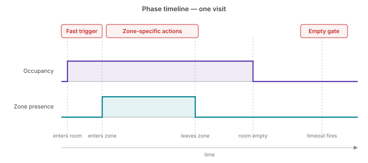

# Automations

This page walks through how to use Occupancy and the per-zone entities to build reliable automations.

## The three phases of presence

Think of a typical "someone walks in, uses the room, leaves" sequence as three phases. Each phase wants a different *kind* of signal — not because of how the device works, but because of what makes a good automation.

- **Fast trigger** — somebody just walked in. Low latency matters; you want the lights on before the person has crossed the threshold. 
- **Zone-specific** — the person is now in a particular region. Targeted actions fire: a mirror light, an extractor fan, a desk lamp. 
- **Empty gate** — the room has been empty long enough that you can safely turn things off. Latency doesn't matter at all; false negatives (declaring the room empty too soon) are the only risk worth caring about.

{ width="100%" }

## Solving it with Occupancy and zone presence

For almost every automation, two entities cover the three phases between them:

- **Occupancy** — `binary_sensor.<device>_occupancy`. A single combined "someone is in the room" signal. The firmware combines the PIR motion sensor, the SEN0609 static-presence radar, and any active zones together on the device, so you get fast detection which remains `on` as long as there is somebody in the room.  See [How detection works → The Occupancy entity](how-detection-works.md#the-occupancy-entity).
- **Zone presence** — `binary_sensor.<device>_zone_<N>_presence`, one per zone you've painted on the grid. Each zone has its own state machine with timing tuned to its [zone type](how-detection-works.md#zone-types-as-preset-bundles) — Bed, Seating, Transit, etc — so a zone holds its presence appropriately for the type of occupation that it represents.

!!! warning
    The target tracker which makes zone presence sensing work loses its targets when they are still for an extended period. This integration
    works around that with the **Presence timeout** and the **Handoff timeout**. That said, you may still experience false negatives 
    where a zone reports `Clear (off)` while it is still occupied. 
    
    Prefer using zone presence sensing turning `Detected (on)` to take positive action (turning lights on),
    and the occupancy sensor turning `Clear (off)` to take negative action (turning lights off).


For zone-specific actions where the number of people matters, use the `sensor.<device>_zone_<N>_target_count` entities, which 
can be enabled with **Settings** > **Entities** > **Zone level** > **Target count**.

!!! note
    Zone entities are translated by their friendly name (`Zone <name>` in the HA UI), but **entity IDs stay as `zone_<N>_presence`** where `<N>` is 0–7. Use entity IDs (not display names) in automations so they keep working if you rename a zone.

## Worked example: passage light

Below are two simple automations, one which turns the passage light on when somebody enters:

```yaml
description: "Turn passage light on when somebody enters"
triggers:
  - trigger: state
    entity_id: binary_sensor.passage_presence_occupancy
    to: "on"
actions:
  - action: light.turn_on
    target:
      entity_id: light.passage

```

and the other which turns the light off when the person exits:

```yaml
description: "Turn passage light off when the last person exits"
triggers:
  - trigger: state
    entity_id: binary_sensor.passage_presence_occupancy
    to: "off"
actions:
  - action: light.turn_off
    target:
      entity_id: light.passage
```

It is usually preferred to combine both of these automations into a single automation which uses trigger IDs to determine
what action to take:

```yaml
triggers:
  - trigger: state
    entity_id: binary_sensor.passage_presence_occupancy
    to: "off"
    id: occupancy_off
  - trigger: state
    entity_id: binary_sensor.passage_presence_occupancy
    to: "on"
    id: occupancy_on
actions:
  - choose:
      - conditions:
          - condition: trigger
            id: occupancy_on
        sequence:
          - action: light.turn_on
            target:
              entity_id: light.passage
      - conditions:
          - condition: trigger
            id: occupancy_off
        sequence:
          - action: light.turn_off
            target:
              entity_id: light.passage

```
## Worked example: bathroom

A bathroom with a **Shower** zone (slot 1) and a **Toilet** zone (slot 2) defined. The aim:

- Main light on the moment anyone enters.
- Mirror light when someone's in front of the mirror.
- Extractor fan on after someone's been in the shower for two minutes (turning on instantly is noisy and looks odd).
- Everything off two minutes after Occupancy drops.

Mapping to the three phases:

- **Fast trigger** → main light on.
- **Zone-specific** → mirror light and extractor fan.
- **Empty gate** → all off two minutes after Occupancy drops. Because Occupancy already includes static presence, a simple `off` trigger with a `for:` duration works — no need to combine multiple entities.

The extractor fan is the most interesting automation because it combines zone presence with a duration and a paired off-action:

```yaml
# Extractor fan: on after 2 minutes of someone in the shower zone,
# off when the shower zone has been empty for 1 minute.
alias: Bathroom extractor fan (shower-zone-driven)
mode: restart
trigger:
  - platform: state
    entity_id: binary_sensor.bathroom_epp_zone_1_presence  # Shower zone
    to: "on"
    for: "00:02:00"
    id: shower_on
  - platform: state
    entity_id: binary_sensor.bathroom_epp_zone_1_presence
    to: "off"
    for: "00:01:00"
    id: shower_off
action:
  - choose:
      - conditions:
          - condition: trigger
            id: shower_on
        sequence:
          - service: switch.turn_on
            target:
              entity_id: switch.bathroom_extractor_fan
      - conditions:
          - condition: trigger
            id: shower_off
        sequence:
          - service: switch.turn_off
            target:
              entity_id: switch.bathroom_extractor_fan
```

Substitute `binary_sensor.bathroom_epp_zone_1_presence` and `switch.bathroom_extractor_fan` with your own device and shower-zone slot.

The rest of the bathroom in sketch form (automations similar in shape to the above, so not shown in full):

- **Main light:** trigger on `binary_sensor.bathroom_epp_occupancy` going `on`, action `light.turn_on`.
- **Mirror light:** trigger on the mirror zone's `zone_<N>_presence` state.
- **Everything off:** trigger on `binary_sensor.bathroom_epp_occupancy` going `off` with `for: "00:02:00"`, action turns off the lights and fan.

!!! example "Screenshot placeholder"
    **Top-down sketch of the bathroom with Shower and Toilet zones marked and the sensor in a corner.** `automations/bathroom-layout.png`

## Worked example: bedroom

A bedroom with a **Bed** zone (slot 1) painted on the grid. The aim:

- Main lights on the moment anyone enters.
- Dim the main lights and turn on bedside reading lights when someone climbs into the Bed zone.
- Lights stay on while someone's in bed reading or asleep — because Occupancy keeps them marked as present, not just the LD2450's moving-target signal.
- Everything off five minutes after Occupancy drops (longer than the bathroom — real beds produce real stillness, and someone re-entering the room after a quick break shouldn't cause the lights to flash off and back on).

Mapping to the three phases:

- **Fast trigger** → main lights on.
- **Zone-specific** → Bed zone dims the main light and turns on the reading lights.
- **Empty gate** → lights off five minutes after Occupancy drops.

The Bed-zone automation is the one worth seeing as YAML — it demonstrates a single trigger driving several parallel light actions:

```yaml
# Bed mode: dim main light and turn on reading lights when someone climbs into bed;
# restore when they leave.
alias: Bedroom bed mode
mode: restart
trigger:
  - platform: state
    entity_id: binary_sensor.bedroom_epp_zone_1_presence  # Bed zone
    to: "on"
    id: bed_on
  - platform: state
    entity_id: binary_sensor.bedroom_epp_zone_1_presence
    to: "off"
    for: "00:00:30"   # small debounce so turning over doesn't flap
    id: bed_off
action:
  - choose:
      - conditions:
          - condition: trigger
            id: bed_on
        sequence:
          - service: light.turn_on
            target:
              entity_id: light.bedroom_main
            data:
              brightness_pct: 15
          - service: light.turn_on
            target:
              entity_id:
                - light.bedroom_reading_left
                - light.bedroom_reading_right
      - conditions:
          - condition: trigger
            id: bed_off
        sequence:
          - service: light.turn_on
            target:
              entity_id: light.bedroom_main
            data:
              brightness_pct: 100
          - service: light.turn_off
            target:
              entity_id:
                - light.bedroom_reading_left
                - light.bedroom_reading_right
```

The rest of the bedroom in sketch form:

- **Main lights:** trigger on `binary_sensor.bedroom_epp_occupancy` going `on` with a **condition** that the room was previously empty (Occupancy was `off` right before the trigger). Action `light.turn_on`.
- **Everything off:** trigger on `binary_sensor.bedroom_epp_occupancy` going `off` with `for: "00:05:00"`, action turns everything off.

!!! tip
    Use Occupancy in the bedroom's empty gate, not `Motion Presence`. The LD2450's moving-target signal drops within seconds when someone stops moving, so a bedroom gated on `Motion Presence` goes dark the moment the reader settles down. Occupancy folds in the SEN0609 static sensor on the device, so it stays `on` while the person is still but breathing.

!!! example "Screenshot placeholder"
    **Top-down sketch of the bedroom with the Bed zone marked and the sensor in a corner.** `automations/bedroom-layout.png`

## Pitfalls

Common traps to avoid when wiring up automations:

!!! warning
    - **Don't automate against `Motion Presence` alone.** It's only the LD2450's moving-target stream; it drops within seconds when the person stops moving. Use `Occupancy` as the combined "someone's in this room" trigger — the firmware already folds the static and moving signals into it on the device.
    - **Don't forget to enable `Zone Presence` at the device level.** The per-zone binary sensors only exist in HA when the device-level toggle is on. If your zone automations aren't firing, check this first.
    - **Don't use a short timeout on the empty gate.** Anything under two minutes will drop out on someone who's only been still for a moment.
    - **Don't automate directly on `Static Presence` for general room presence.** It's published as a debug/visibility signal, disabled by default. Occupancy is the combined output that includes static presence — automate against that.
    - **Don't confuse `Zone Rest of Room` with `Occupancy`.** Rest of Room (zone 0) means a target is in the room but outside any named zone; Occupancy means any presence anywhere. They overlap, but use Occupancy for the fast trigger, not zone 0.

## Troubleshooting

| Symptom | Likely cause | Fix |
| --- | --- | --- |
| Automation referencing `zone_<N>_presence` never fires | Device-level **Zone Presence** toggle is off — the entity is disabled in Home Assistant's entity registry | Enable **Zone Presence** on the device page. See [Detection zones](detection-zones.md#troubleshooting). |
| Automation referencing **Static Presence** always reports off | Static Presence entity is disabled on the device page (default) | Enable the Static Presence entity in Home Assistant. Usually you don't need it — **Occupancy** already folds it in. |
| Lights turn off on someone who's clearly still present | Empty-gate timeout too short, or you're gating on `Motion Presence` instead of `Occupancy` | Gate on `binary_sensor.<device>_occupancy` with `for: "00:02:00"` or longer. Occupancy already includes static presence on the device. |
| Sofa / reading-chair zone flaps on and off | Zone type is "Default" — fall-off too fast | Change the zone's type to **Seating** in the [Detection zones](detection-zones.md) editor. |
| Bedroom zone flaps on and off when sleeping | Zone type is "Default" — presence timeout too short | Change the zone's type to **Bed** in the [Detection zones](detection-zones.md) editor. |
| Automation fires on a quick pass-through a hallway | Zone type is "Default" — entry threshold too quick | Change the zone's type to **Transit** in the [Detection zones](detection-zones.md) editor. |

See also: the [central Troubleshooting](troubleshooting.md) page for conceptual FAQ and how to open a GitHub issue.

## Where to next

- **[Settings →](settings/index.md)** — tune detection ranges, reporting intervals, LED/relay behaviour, and more.
- **[Firmware upgrades →](firmware-upgrades.md)** — keep firmware up to date over the air.
