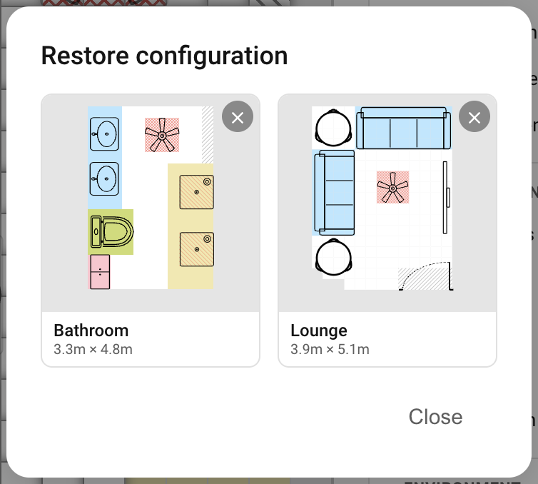

# Backup and restore

A **backup** is a saved snapshot of everything the panel knows about a device, except the four-corner calibration. Backups live in the integration on your Home Assistant instance, so they survive panel reloads and follow the device through firmware upgrades.

The main reason to keep a backup is recalibration. The calibration itself can't be replayed automatically: it's specific to where the device is physically mounted. Anything that disturbs the mount (moving or rotating the sensor, reshaping the room, replacing the device, or re-flashing firmware that wiped its calibration) invalidates it.

The typical flow:

1. **Backup** the current configuration.
2. **Recalibrate** the room. This deletes zones, overlays, and furniture as part of resetting the grid.
3. **Restore** the backup. Zones, overlays, furniture, and settings come back.

It's also worth backing up before any sweeping change you might want to undo, like reworking a tricky overlay layout or trying a Custom-zone tuning.

## What's in a backup

Everything the panel knows about the device apart from the calibration itself:

- **Room boundary and dimensions:** the painted room shape and its width × depth in metres.
- **Zones:** all eight slots (room (zone 0) plus the seven user-paintable zones), with each zone's name, colour, type, and (for **Custom** zones) the four thresholds Trigger / Renew / Presence timeout / Handoff timeout.
- **Overlays:** Entry/Exit, Interference, Suppress markings on every cell.
- **Furniture:** every placed item with position, size, rotation, and icon.
- **Settings**, in full:
    - Detection ranges (target / static, auto and manual values)
    - Sensor calibration (motion timeout, static delay/timeout, static trigger/renew thresholds, environmental offsets)
    - LED mode, brightness, occupancy colour
    - Relay trigger and contact mode
    - Per-component log levels
    - Entity enable/disable flags
    - Update rates (zone and target)

## What's *not* in a backup

| Excluded | Why |
| --- | --- |
| **The four-corner calibration** | Specific to where the device is physically mounted. Two devices in the same kind of room will have different calibrations; the same device after being moved will too. |

The room *dimensions* travel with the backup (so the grid stays coherent), but the calibration that maps radar coordinates onto that grid does not. After restoring on a freshly-calibrated device, the grid is the right shape and the zones land in the right cells; the calibration you just did is what tells the radar where to put targets within them.

## Saving a backup

1. Open the sidebar overflow menu (⋯) and click **Backup configuration**.
2. Enter a name and click **Save**.

Backups are stored per-Home-Assistant-instance, so any backup you save can be restored onto any device on the same HA instance.

## Restoring a backup

1. Open the sidebar overflow menu and click **Restore configuration**. A grid of saved backups appears, each with a thumbnail showing its zones and furniture.
2. Click a card to apply it. The panel immediately replaces the current grid, zones, overlays, furniture, and settings with the backup's contents and pushes the new configuration to the device.

Clicking a card applies it straight away, with no confirmation dialog and no preview. If you want to keep the current state before trying something else, save a fresh backup first.

## Deleting a backup

Open the Restore dialog, hover a card, and click the **X** in the top-right corner. The backup is deleted immediately, with no confirmation and no undo. Deleting only removes it from the library; any device that previously had it applied keeps its current configuration.

## Troubleshooting

| Symptom | Likely cause | Fix |
| --- | --- | --- |
| Restore dialog says "No configurations" | No backup has been saved on this Home Assistant instance yet | Save a backup first from any device. Backups are shared across all devices in the same HA instance. |
| Restored backup but the radar puts targets in the wrong cells | The device's calibration doesn't match the room dimensions in the backup | Recalibrate the device. The backup's grid is fine; the calibration needs to be redone. |

Still stuck? See [Troubleshooting](troubleshooting.md) for how to open an issue.

## Where to next

- **[Calibration →](calibration.md)** — the one thing a backup doesn't restore for you.
