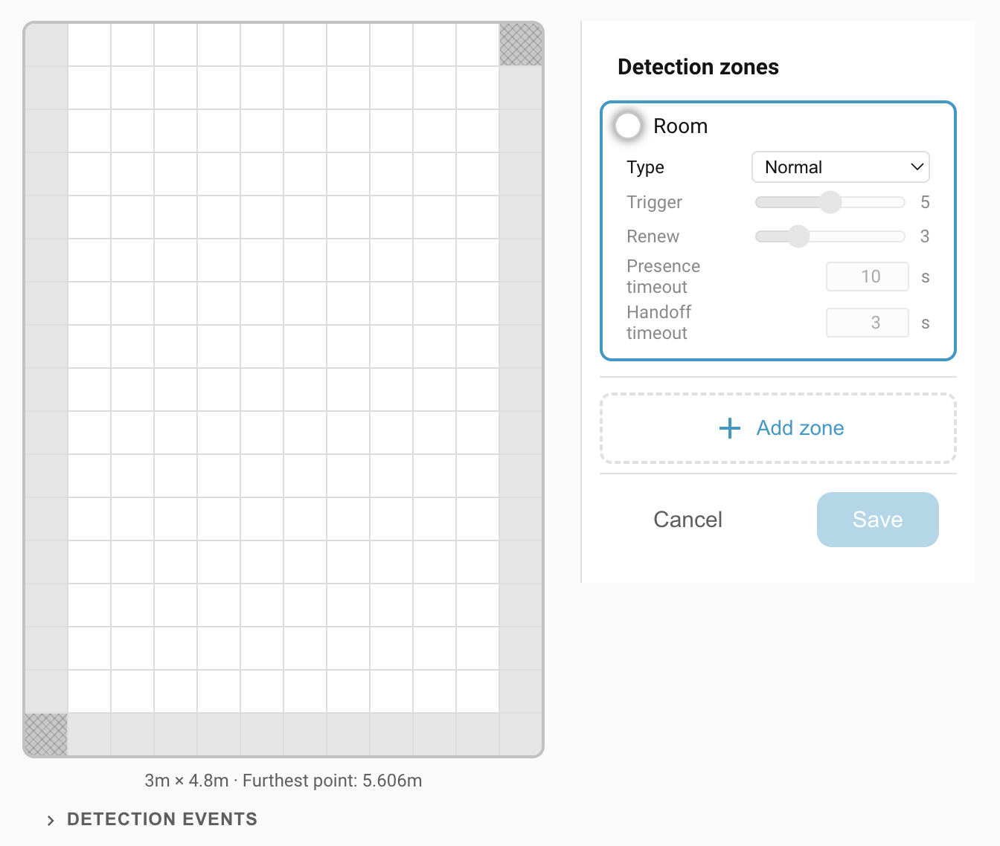
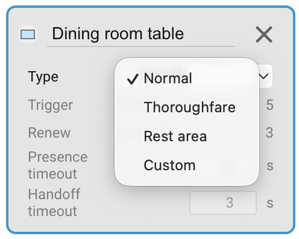
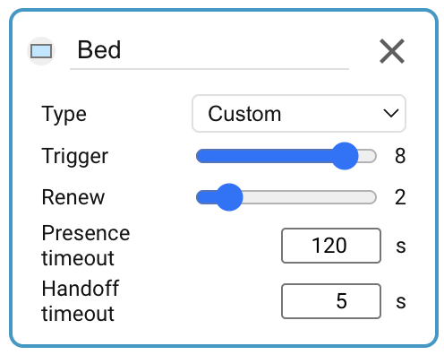

# Detection zones

A zone is a named set of grid cells — typically a region of your room you care about, like "Desk", "Sofa", or "Doorway". Each zone gets its own occupancy and target-count entities in Home Assistant, which you can wire up in automations. This page covers creating zones, painting cells into them, tuning their behaviour, and what entities end up in HA.

## The zone list

Open the Device Configuration tab and switch the sidebar to the **Detection zones** editor mode. The sidebar shows two things:

- A permanent **Room** entry at the top — this is the zone 0 fallback (see below).
- A list of your named zones. You can have up to 7. The **Add zone** button is disabled once all seven slots are used.

## The Room zone (zone 0)

The first entry in the list, labelled **Room**, is zone 0 — the "rest of room" fallback. Any target the sensor sees that isn't inside one of your named zones counts as being in the Room zone. It's always present and can't be deleted.

Painting the Room zone is different from painting a named zone: you're editing the room **boundary** rather than a zone interior.

- Click a grey cell **outside** the current room → the cell is added to the room.
- Click a white cell **inside** the current room → the cell is removed from the room (it's no longer considered part of your room at all).

Keep the room boundary tight to your real walls. Cells outside the room are ignored by the zone engine; overlays and named zones can't be painted on them either.

!!! note 
    You can mark cells as **outside** cells even if they are completely surrounded by **inside** cells. Imagine a column in the middle of the room. It is effectively outside the room, even though it is surrounded by the room.

## Creating and painting a named zone

Once calibration is done and the room boundary looks right, add your first named zone:

1. Click **Add zone** in the sidebar. A new zone appears, selected and ready to paint, with a default name and colour.
2. On the grid, click-and-drag to paint cells into the zone. The action for the whole drag — paint or erase — is decided by the cell you first press on: if it's already part of the zone, the stroke erases; otherwise the stroke paints.
3. Release the mouse to commit the stroke.

## Renaming, recolouring, deleting

- **Rename** — click the zone name field in the sidebar; edit inline; the new name takes effect immediately.
- **Recolour** — click the colour swatch next to the zone name; a colour picker appears. Pick a colour that stands out against your other zones; the live overview uses it to shade the zone.
- **Delete** — click the **×** button on the zone's sidebar row. The zone and its cells disappear; any cells that were in the zone fall back into the Room zone.

## Per-zone settings

The LD2450 target tracker can lose a target when there is no movement for a few seconds, such as happens when the target is asleep in bed. To avoid zone presence sensors flapping states every few seconds, you can specify the type of presence you expect for a particular zone. For instance, you would expect:

- a passage to be quick entry and exit.
- a bed to have long term presence with little movement. 
- targets to appear out of nowhere in a doorway.
- targets to reach a sofa zone by transiting an adjacent zone.

Each zone has a **type**, which picks sensible defaults for four behaviour thresholds. For most rooms, one of the built-in types works without further tuning.

- **Default** — balanced defaults. Use for living-room zones, kitchen zones, generic "somebody's in this area" detection.
- **Bed** — long presence timeout for bedroom monitoring. Designed for someone lying still in bed for extended periods (10-minute presence timeout, slower trigger).
- **Seating** — for sofas, reading chairs, dining seats. Slower trigger but a longer hold-on so brief stillness doesn't drop presence.
- **Transit** — fast fall-off. Use for hallways and doorways where you want presence to drop quickly after someone has walked through, so it doesn't keep a light on forever.
- **Custom** — expose the four thresholds below for direct tuning.

## Zone presence and custom settings

The zone presence algorithm works as follows:

- A zone entity starts with state **clear**.
- If a target appears in a zone with a *signal strength* at least equal to the **Trigger** threshold, then the zone changes to **detected**.
- If the target disappears from the zone (without being handed off - see below), then the zone moves to an internal **pending** state. The zone entity continues to report **detected**.
- If a target appears in the zone with a signal strength at least equal to the lower **Renew** threshold, then the zone clears the internal **pending** state and the entity continues to report **detected**.
- Alternatively, if a target doesn't reappear within **Presence timeout** seconds, then the zone entity switches to the **clear** state.

### Handoff

If a target moves to an adjacent zone (instead of just disappearing) then the zone switches to the internal **pending** state, but then it only waits for **Handoff timeout** seconds before it switches to the **clear** state. In other words, the target has been *handed off* to an adjacent zone.

An exception to this is entrances and exits, where you expect targets to appear out of nowhere. These areas are marked with the **entrance/exit overlay** (see [Overlays](overlays.md)), which causes them to always use the **Handoff timeout** instead of the **Presence timeout**.

## Entities exposed in Home Assistant

Each configured zone supports two entities:

- **Zone Presence** — a `binary_sensor.<device>_zone_N_presence` entity. The integration renames these to follow the zone: a named zone becomes `Zone <name>` (e.g. `Zone Sofa`), and Zone 0 becomes `Zone Rest of Room`. Zone 0's presence sensor is `on` whenever the sensor sees a target anywhere in the room that isn't inside one of your named zones.
- **Zone Target Count** — a `sensor.<device>_zone_N_target_count` entity, with the same `Zone <name>` / `Zone Rest of Room` display-name treatment. Reports the number of tracked targets currently inside that zone.

**Zone Presence** entities are enabled by default, but **Zone Target Count** entities are disabled by default. This can be configured in the [Entities Settings](settings/entities.md).

## Troubleshooting

| Symptom | Likely cause | Fix |
| --- | --- | --- |
| New zone created in the panel but no `zone_<N>_presence` entity visible in Home Assistant | The device-level **Zone Presence** toggle is off — the entity is disabled in the HA entity registry | Enable **Zone Presence** on the device page. If you want to see the entity in "disabled" state meanwhile, set Home Assistant's entity-registry filter to "Include disabled entities". |
| Renamed a zone but the HA entity display name still says "Zone N Presence" | Integration hasn't refreshed the entity registry entry yet | Reload the **Everything Presence Pro Grid** integration from Settings → Devices & Services, or reboot the device. |
| `Zone Rest of Room` is always `on`, even when nobody's in the room | An interference source is inside the room but outside any named zone | Paint an Interference overlay on the problem cells. See [Overlays](overlays.md). |
| Zone flaps on and off on someone who isn't moving much | Zone type is "Default" — presence timeout is short | Change the zone's type to **Seating** (sofa, chair), **Bed** (bedroom), or **Custom** with a longer Presence timeout. |

See also: the [central Troubleshooting](troubleshooting.md) page for conceptual FAQ and how to open a GitHub issue.

## Where to next

- **[Overlays →](overlays.md)** — mark doorways and interference sources on the grid to refine how the zone engine interprets events.
