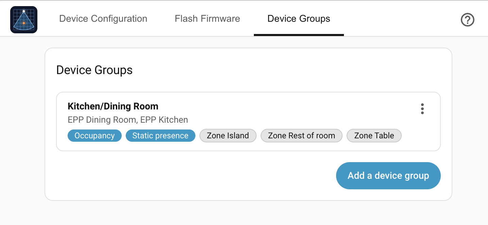
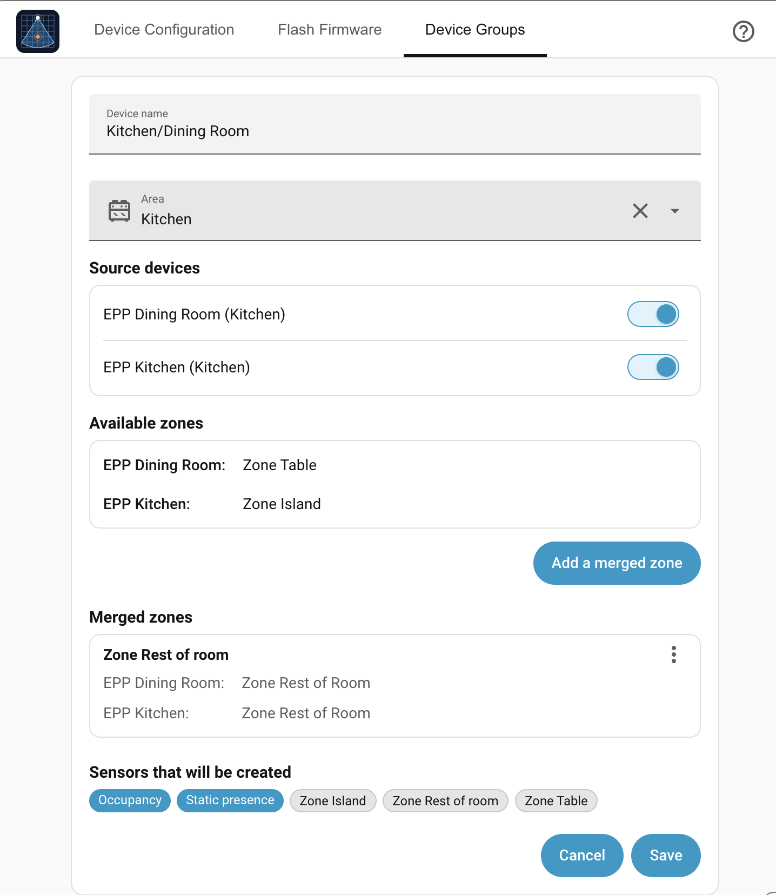

# Device Groups

A single Everything Presence Pro Grid sensor may not cover a whole room. Device
Groups let you combine 2 or more physical sensors into a single virtual device
in Home Assistant — so automations can target "Master Bedroom" without ORing
multiple sensors by hand.

A device group exposes:

- One **occupancy** binary sensor that is on if any source sensor's occupancy is
  on.
- The same for **static presence**, **motion presence**, **target presence**,
  and **mmWave presence** — each only created if at least one source has that
  entity enabled.
- One binary sensor per **zone** on each source — passing through with the
  zone's original name.
- One binary sensor per **zone group** you define — for combining zones from
  different sources into a single named area (e.g. left-bed + right-bed → bed).

If a source goes offline, the device group ignores it. The helper becomes
unavailable only when every source is unavailable.

## Creating a device group

1. Open the Everything Presence Pro Grid panel.
2. Switch to the **Device Groups** tab.
3. Click **Add a device group**.
4. Enter a **Device name**.
5. Optionally choose an **Area** to assign the virtual device (and its source
   devices) to.
6. Under **Source devices**, toggle on the sensors it should aggregate.
7. To combine zones from different sensors into one binary sensor, click **Add a
   merged zone**, tick **two or more** zones, give the merged zone a name (e.g.
   "Bed"), and click **Merge**. The merged zone appears under **Merged zones**;
   each one becomes a single binary sensor.
8. **Sensors that will be created** previews the exact entities the group will
   expose.
9. Click **Save**.

The new virtual device appears under **Settings → Devices & Services → EPP
Grid** with all its aggregated entities.

## Editing or deleting

Each device group in the list has a **⋮ menu**:

- **Edit** reopens the editor — change the name, sources, area, or merged zones
  and **Save**.
- **Delete** removes the group and all its helper entities.

A merged zone has its own **⋮ menu** inside the editor for editing or removing
just that zone.

## What happens when…

| Event                               | Behavior                                                                                                                                |
| ----------------------------------- | --------------------------------------------------------------------------------------------------------------------------------------- |
| A source device goes offline        | It's ignored. Helper still tracks the rest.                                                                                             |
| You delete a zone on a source       | If it was in a merge group, the group keeps its definition but the entity goes unavailable. Add another zone to the group or delete it. |
| You rename a source device or zone  | Display names update; the helper's entities keep their unique IDs and don't break.                                                      |
| You remove a source device entirely | The group keeps it in its source list but shows it as unavailable, and the helper ignores it. Edit the group to remove or replace it.   |

## Where to next

- **[Automations →](automations.md)** — put the group's Occupancy and zone-presence entities to use with worked examples.
