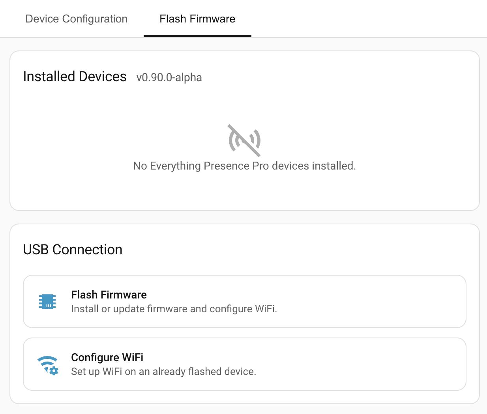
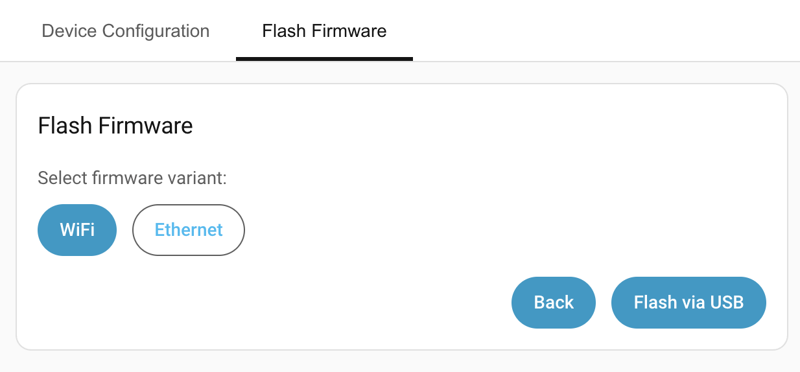
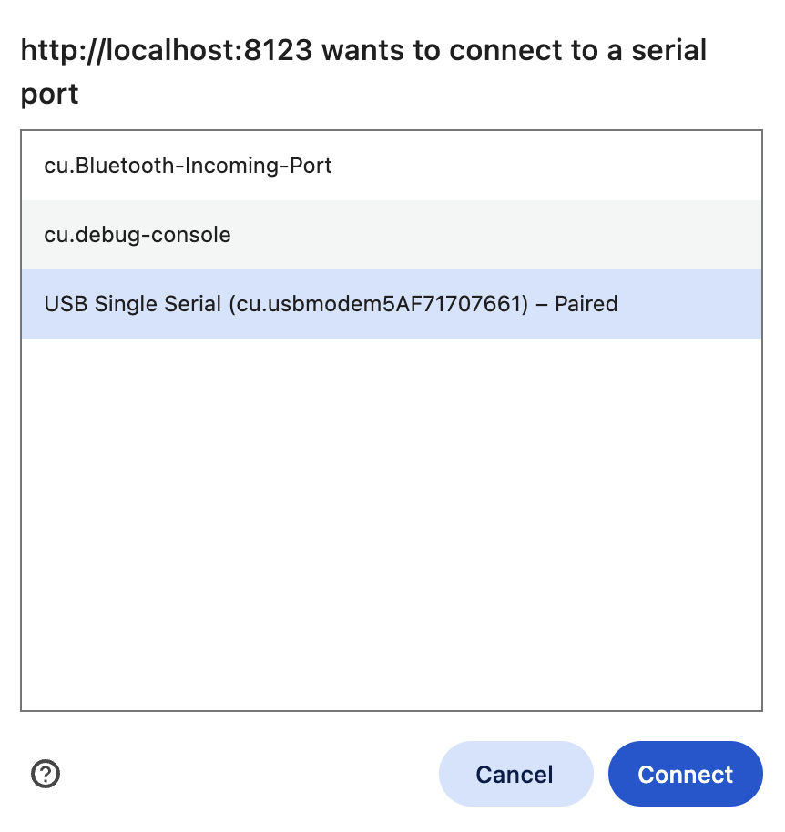

# Flashing firmware

This page covers flashing Everything Presence Pro Grid firmware onto your device for the first time. Once flashed, future updates happen over the air — see [Firmware upgrades](firmware-upgrades.md).

## Prerequisites

- **Chrome or Edge browser.** Flashing uses the Web Serial API, which only works in Chromium-based browsers.
- **A data USB cable.** Charge-only cables won't work — the browser will show no ports.
- **The device plugged into the same computer** as the Chrome/Edge browser.

## Flashing

1. Open the **Flash Firmware** tab in the Everything Presence Pro Grid panel.
2. Click **Flash Firmware**.

    

3. Pick the firmware variant based on how you want the device to connect to your network, then click **Flash via USB**:
    - **WiFi** — connect over Wi-Fi.
    - **Ethernet** — connect over an Ethernet cable (PoE optional).

    

4. In the browser's serial-port picker, select your device and click **Connect**.

    

5. The device flashes and reboots automatically when done.
6. (WiFi variant only) After the device reboots, set up Wi-Fi: scan for networks or enter the SSID manually, then the password.

!!! warning
    If the browser shows no ports when you click Connect, the cable is the most common cause. Swap for a known-good data cable before troubleshooting the device.

!!! example "Screenshot placeholder"
    **Flasher mid-flash — progress indicator showing "Flashing firmware…".** `firmware/flasher-progress.png`

## Add the device to ESPHome

The Wi-Fi flashing flow usually adds the device to Home Assistant automatically via ESPHome. If not — or if you flashed the Ethernet variant — add it manually:

1. In Home Assistant, go to **Settings → Devices & services**.
2. Look for a **Discovered** card for your device. Click **Configure** and follow the prompts.
3. If the device isn't discovered, click **Add Integration**, search for **ESPHome**, and enter the device's hostname (typically `everything-presence-pro-<suffix>.local`) or IP address.

Once the device is added to ESPHome, it shows up in the Everything Presence Pro Grid panel within a few seconds.

!!! note
    Everything Presence Pro Grid identifies each device by its MAC address. Re-flashing or swapping variants keeps your saved zones, calibration, and settings — they're keyed to the MAC.

## Reconfiguring Wi-Fi

To change Wi-Fi credentials on an already-flashed device without a full re-flash:

1. In the Flash Firmware tab, click **Configure WiFi** under USB Connection.
2. Connect via USB, scan for networks or enter the SSID manually, enter the password.
3. Click **Continue**.

## Troubleshooting

| Symptom | Likely cause | Fix |
| --- | --- | --- |
| Browser port picker shows no devices | Charge-only USB cable | Swap for a data cable. |
| Device flashed but doesn't appear in HA | ESPHome hasn't discovered it yet | Add ESPHome manually with the device's hostname or IP, per the steps above. |
| Device is on ESPHome but not showing in the Grid panel | Device running the original firmware, not Grid firmware | Check for a **Firmware Version** sensor on the ESPHome device page. If missing, re-flash. |

## Where to next

- **[Placement →](placement.md)** — mount the device where the sensors can do their job.
