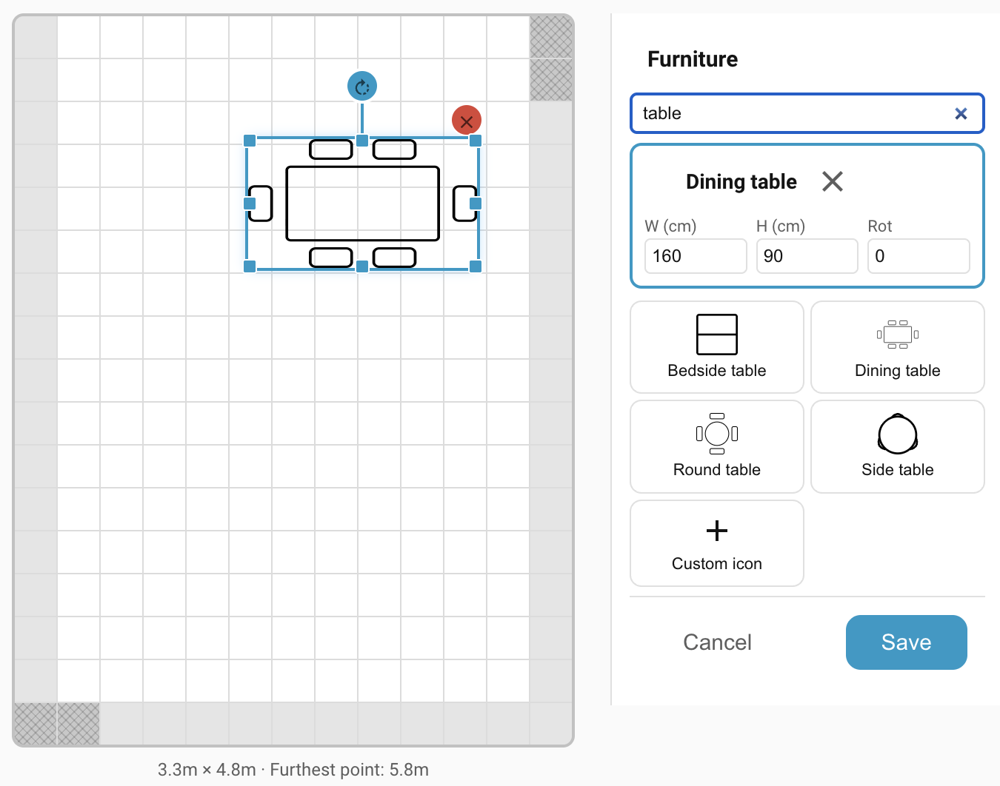

# Furniture

Furniture is a purely visual layer. You place icons for sofas, beds, tables, and appliances on the grid so the live overview is immediately interpretable. Unlike zones and overlays, furniture **does not affect detection** at all; it's decoration that helps you and future you reason about what the sensor is seeing.

## Why place furniture

Without furniture, the live overview is a coloured grid with dots moving on it. You can read it, but it takes effort. Adding furniture turns the grid into something that looks like your actual room:

- Real-time targets make intuitive sense ("that's someone walking past the dining table").
- Ghost detections become explainable ("that's always the ceiling fan over the reading chair").
- When you come back to tune zones six months from now, you still know what each cell represents.

!!! note
    Furniture has no effect on detection. Only the **Detection zones** editor (room boundary + named zones) and the **Overlays** editor (Entry/Exit, Interference, Suppress) change how the zone engine behaves. Anything you do in the Furniture editor is cosmetic.

## Adding furniture

1. Switch to the **Furniture** editor mode in the sidebar.
2. The sidebar lists the preset stickers — beds, sofas, tables, kitchen and bathroom items, doors, plants, and so on. Use the search box at the top to filter by name.
3. Click a sticker. The item lands centred in the room at its default real-world dimensions (in millimetres).
4. Drag the item to position it on the grid.

## Moving, resizing, rotating

Select a furniture item on the grid by clicking it. Handles appear for every operation:

- **Move** — click and drag anywhere inside the item.
- **Resize** — drag one of the eight resize handles: four corners, four edges (cardinal directions). The defaults match typical real-world dimensions, but real rooms are full of non-standard furniture — resize to match what you actually have.
- **Rotate** — drag the circular handle on the rotation stem that extends above the item.
- **Delete** — click the red **×** button at the top right of the selected item.

!!! tip
    Use the door stickers (`door-left-swing`, `door-right-swing`, `sliding-door`) exactly where you've drawn Entry/Exit [overlays](overlays.md). It gives future-you a visible reminder of why those overlays are there — otherwise the hatched overlay cells look arbitrary.

!!! example "Screenshot placeholder"
    **Grid with a dressed room — bed, dining table and chairs, sofa, doors marked at entry points.** `furniture/dressed-room.png`

## Keyboard shortcuts

When a furniture item is selected, the following keyboard shortcuts are enabled:

| Key | Action |
| --- | --- |
| **Delete** / **Backspace** | Delete the selected item |
| **Escape** | Deselect |
| **Ctrl/Cmd + C** | Copy |
| **Ctrl/Cmd + X** | Cut |
| **Ctrl/Cmd + V** | Paste — the new item lands one cell offset from the original so you can see it |

## Custom icons

If none of the presets match what you want to represent, pick the **+** custom-icon slot at the end of the sticker list. It opens Home Assistant's built-in icon picker, which lets you choose any icon from the standard Material Design Icons set (`mdi:*`) bundled with HA. Once added, the item behaves like any other piece of furniture: placed, moved, resized, rotated, deleted.

## Troubleshooting

See: the [central Troubleshooting](troubleshooting.md) page for conceptual FAQ and how to open a GitHub issue.

## Where to next

- **[Backup and restore →](backup-restore.md)** — save the device configuration so you can roll back after recalibration or experiments.
- **[Settings →](settings/index.md)** — tune detection, reporting, environmental offsets, LED and relay behaviour.
- **[Automations →](automations.md)** — put it all to use with worked examples.
