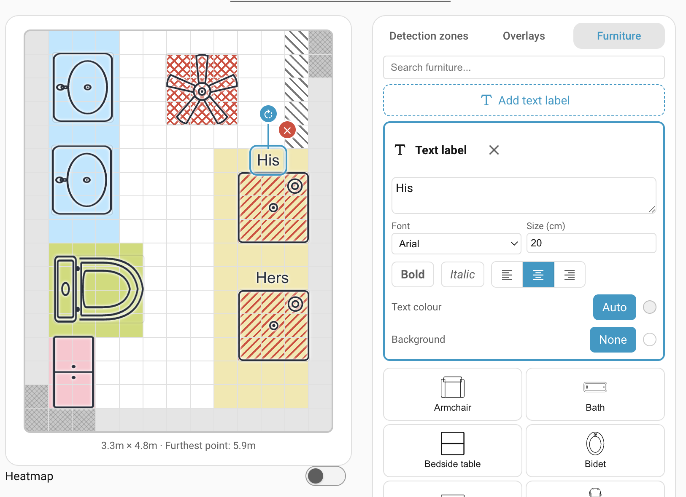

# Furniture

Furniture is a purely visual layer. You place icons for sofas, beds, tables, and
appliances on the grid so the live overview is easy to read. Furniture **does
not affect detection** in any way; it's decoration.

Adding furniture turns the live overview into something that looks like your
actual room. Real-time targets make intuitive sense ("that's someone walking
past the dining table"), ghost detections become explainable ("that's always the
ceiling fan over the reading chair"), and when you come back to tune zones six
months from now, you still know what each cell represents.

!!! note

    Only the **Detection zones** editor (room boundary and named zones) and the
    **Overlays** editor (Entry/Exit, Interference, Suppress) change how the zone
    engine behaves. Anything you do in the Furniture editor is cosmetic.

## Adding furniture

1. Switch to the **Furniture** editor mode in the sidebar.
1. The sidebar lists the preset stickers — beds, sofas, tables, kitchen and
    bathroom items, doors, plants, and so on. Use the search box at the top to
    filter by name.
1. Click a sticker. The item lands centred in the room at its default real-world
    dimensions (in millimetres).
1. Drag the item to position it on the grid.

## Moving, resizing, rotating

Click a furniture item on the grid to select it. Handles appear for every
operation:

- **Move:** click and drag anywhere inside the item.
- **Resize:** drag one of the eight handles. **Corner handles resize
    proportionally** — the item keeps its shape. **Edge handles** (top, bottom,
    left, right) **stretch just that one dimension** — use them when your real
    furniture isn't the same proportions as the preset. The defaults match
    typical real-world dimensions, so a corner drag is usually all you need to
    scale an item to your room. (Plain icon stickers always keep their
    proportions; very small items show only the corner handles.)
- **Rotate:** drag the circular handle on the rotation stem that extends above
    the item.
- **Delete:** click the red **×** button at the top right of the selected item.

!!! tip

    Place the door stickers (`door-left-swing`, `door-right-swing`, `sliding-door`)
    exactly where you've drawn Entry/Exit [overlays](overlays.md). The doorway icons
    make it easy to see why the hatched overlay cells are there.

## Keyboard shortcuts

When a furniture item is selected, the following keyboard shortcuts are enabled:

| Key                        | Action                                                                        |
| -------------------------- | ----------------------------------------------------------------------------- |
| **Delete** / **Backspace** | Delete the selected item                                                      |
| **Escape**                 | Deselect                                                                      |
| **Ctrl/Cmd + C**           | Copy                                                                          |
| **Ctrl/Cmd + X**           | Cut                                                                           |
| **Ctrl/Cmd + V**           | Paste. The new item lands one cell offset from the original so you can see it |

## Custom icons

If none of the presets match what you want to represent, pick the **+**
custom-icon slot at the end of the sticker list. It opens Home Assistant's
built-in icon picker, which lets you choose any icon from the standard Material
Design Icons set (`mdi:*`) bundled with HA. Once added, a custom icon behaves
like any other piece of furniture.

## Text labels

Text labels let you annotate the layout — room names, a "TV" caption over the
media unit, a note next to a tricky corner — as free-floating text that scales
with the room, just like furniture.

1. In the **Furniture** sidebar, click **Add text label**. A label lands centred
    in the room.

1. Move, resize, and rotate it on the grid exactly like a furniture item (corner
    handles keep its proportions).

1. With the label selected, its options appear in the sidebar:

    - **Text** — the words to show.
    - **Font** — pick from the built-in fonts.
    - **Size (cm)** — the real-world text height. Like furniture, it scales with
        the room, so the label keeps its size relative to everything else.
    - **Bold**, **Italic**, and **Alignment** (left, centre, right).
    - **Text colour** — choose a colour, or leave it on **Auto** to automatically
        contrast against whatever is behind it.
    - **Background** — leave it as **None** for plain text, or pick a colour for
        a filled box behind the text.

To remove a label, click the **×** next to its name in the sidebar, or select it
and press **Delete**.

## Troubleshooting

Still stuck? See [Troubleshooting](troubleshooting.md) for how to open an issue.

## Where to next

- **[Backup and restore →](backup-restore.md)** — save the device configuration
    so you can roll back after recalibration or experiments.
- **[Settings →](settings/index.md)** — tune detection, reporting, environmental
    offsets, LED and relay behaviour.
- **[Automations →](automations.md)** — put it all to use with worked examples.
