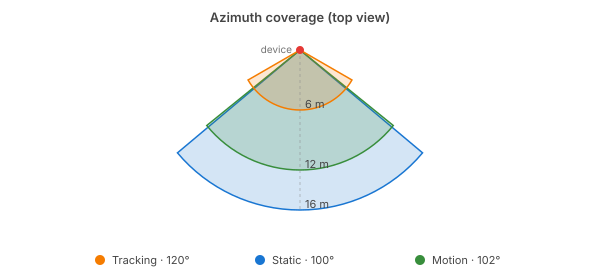
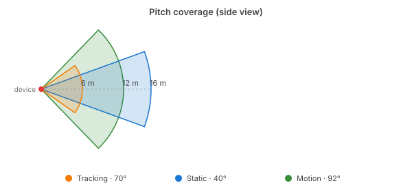

# Hardware

The Everything Presence Pro packs several sensors into one small unit: two
mmWave radars, a PIR (passive infrared) motion sensor, environmental sensors for
illuminance, temperature, humidity, an optional CO₂ sensor, and a network
interface. Each presence sensor has its own blind spots, which is why Everything
Presence Pro Grid combines all three into a single Occupancy signal.

## Motion — fast infrared motion sensor

The PIR (passive infrared) motion sensor
([Panasonic EKMC1603111](https://industrial.panasonic.com/ww/products/pt/papirs/models/EKMC1603111))
is the fastest of the three sensors. It detects body heat in motion and responds
in a fraction of a second.

- **Field of view:** 102° horizontal × 92° vertical.
- **Detection range:** up to 12 m.
- **Strength:** quickest to react, and the widest field of view of the three.
- **Weakness:** only triggers on movement, and stops reporting within seconds
    once someone is still.

## The mmWave radars

Two mmWave radars cover different jobs.

### LD2450 — movement tracker

The
[LD2450](https://www.tinytronics.nl/product_files/006000_HLK-LD2450-Instruction-Manual.pdf)
is the workhorse. It reports 2D coordinates for up to three moving targets,
which Everything Presence Pro Grid uses to drive zone detection and target-count
entities.

- **Field of view:** 120° horizontal × 70° vertical.
- **Tracking depth:** up to 6 m.
- **Concurrent targets:** up to 3.
- **Strength:** reports each person's 2D position in the room.
- **Weakness:** loses people who are genuinely still (reading, sleeping) after a
    few seconds, because tracking relies on frame-to-frame radar changes.

### SEN0609 — static-presence radar

The [SEN0609](https://docs.rs-online.com/b042/A700000013081548.pdf) is a DFRobot
static-presence mmWave module that fills in where the LD2450 drops off. It only
reports whether the room is occupied — "here" or "not here" — with no
coordinates.

- **Field of view:** 100° horizontal × 40° vertical.
- **Range:** up to 16 m.
- **Strength:** picks up still occupants the LD2450 loses (reading, sleeping,
    showering), and reaches much further than the LD2450's tracking circle.
- **Weakness:** no per-target information, just a single room-wide presence
    signal.

## How the sensors complement each other

Each presence sensor has a blind spot that at least one of the others covers:

- **Motion** sees movement with the lowest latency.
- **LD2450** sees movement with coordinates, inside 6 m.
- **SEN0609** sees stillness without coordinates, out to 16 m.

{ width="100%" }

{ width="100%" }

The **Occupancy** binary sensor in Home Assistant — the one you'll typically
automate against — combines all three presence signals into a single entity.
Each sensor on its own has gaps; together they cover each other.

For example: someone walks into the bedroom and climbs into bed. The motion
sensor catches the entry in a fraction of a second, so the main lights come on
instantly. The LD2450 then tracks them across the room. When they reach the bed,
an automation turns the main lights off and dims the bedside reading lights.
Once they settle in and stop moving, the LD2450 loses them, but the SEN0609
keeps the room marked occupied, so Home Assistant still knows someone's there,
so the main lights don't come on again when their partner enters the room.

## Environmental sensors

Three environmental sensors ride along with the presence sensors and report room
conditions independently.

- **BH1750** — illuminance, in lux.
- **SHTC3** — temperature and humidity.
- **SCD4x / SCD40** — CO₂. **Optional add-on** — fit it yourself following
    Everything Smart's
    [installation guide](https://docs.everythingsmart.io/s/products/doc/integrate-the-carbon-dioxide-co2-module-biegKGfCWu).

All four entities are disabled in Home Assistant by default. Enable the ones you
want from the device page (Settings → Entities), or from Home Assistant's entity
registry.

!!! warning

    **Temperature & Humidity Accuracy** The device packs significant processing
    power into a compact enclosure. This generates heat that affects the temperature
    and humidity readings, which means that these readings do not reflect actual
    room conditions. These sensors are included for users who may find them useful
    despite limitations, but should not be relied upon for accurate climate control.
    For this reason they are disabled by default.

## LED and relay

The front LED can reflect device state (occupancy, CO₂ level) or be driven
directly from your own automations. The solid-state relay output can feed
presence into an alarm system, or drive low-voltage equipment directly.

See Everything Smart's
[hardware overview](https://docs.everythingsmart.io/s/products/doc/hardware-overview-gqc0XAh0e5)
for relay wiring and ratings.

## Connectivity

Two firmware variants differ only in which network interface is active:

- **`wifi-ble-co2`** — Wi-Fi. Needs SSID and password at flash time.
- **`ethernet-ble-co2`** — Ethernet. Plug in, power up, and the device shows up
    on the LAN. Supports Power over Ethernet (PoE), so a single cable handles
    data and power.

Both variants also include **Bluetooth LE**. Home Assistant exposes each device
as a Bluetooth proxy for nearby BLE devices like temperature tags, buttons, or
presence badges. If you've got BLE hardware around the house, each device
becomes another reception point.

A **BLE Scan** switch under the device's Configuration entities lets you turn
the scan off when you don't need the proxy — useful if you have heavy
proxied-BLE load and need to claw back heap headroom (each proxied device adds
~5-10 KB resident, plus transient processing spikes). See
[Troubleshooting → Free up memory by disabling BLE](troubleshooting.md#free-up-memory-by-disabling-ble)
for the trade-off in numbers.

## Where to next

- **[Installation →](installation.md)** — install the integration and start
    flashing.
