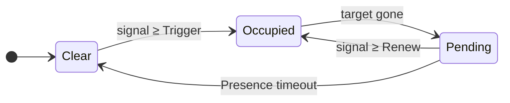
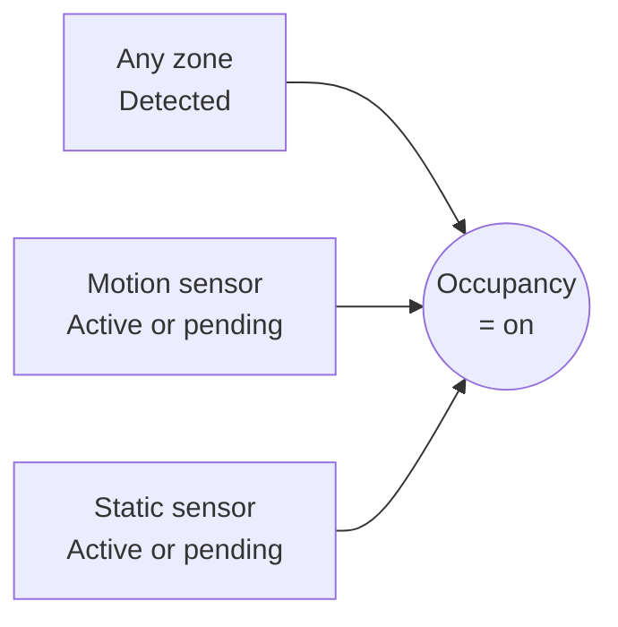

# How detection works

This page explains what the zone detection engine does between the radar producing a target and Home Assistant seeing a presence entity flip. You don't strictly need to read it — the defaults work — but understanding the flow helps when you tune zones or chase a misbehaving one.

The engine runs on the device, ten times a second.

## Inputs

Three things feed the engine on every tick:

- **Targets** — the LD2450 mmWave sensor reports up to three targets at roughly 10 frames per second. Each frame gives an `x, y` position in metres for any target it currently sees.
- **Calibrated grid** — your room is divided into uniform cells. Each cell is either inside the room or outside, optionally belongs to a zone, and may carry an overlay (Entry/Exit, Interference, or Suppress). See [Detection zones](detection-zones.md) and [Overlays](overlays.md).
- **Auxiliary presence sensors** — the SEN0609 static-presence sensor and the PIR motion sensor produce simple on/off signals. They're independent of the target tracker.

## Smoothing and signal strength

Raw radar positions jitter from frame to frame, even when a person is standing still, and individual frames sometimes drop out entirely. The engine smooths this with a rolling one-second window per target:

- The last second of frames is held in memory.
- Each tick the engine recomputes the **median** `x` and `y` across the frames in the window in which the target was active. In uses a median rather than a mean so that a single-frame outlier doesn't pull the position. Silent frames don't contribute.
- The window **slides** — it's not chopped into independent one-second buckets. Each tick adds the newest frame and drops the oldest.
- The smoothed median position is what the rest of the engine (cell mapping, continuity, gating) operates on.

The LD2450 produces frames at a fixed 10 Hz — one position update per tracked target every 100 ms — and the engine ticks once per frame. So the smoothed position updates ten times a second, but each update is always backed by a full second of measurements. Consecutive ticks share roughly nine-tenths of their input, which is why the position you see on the live overview moves smoothly rather than stepping in one-second jumps.

The same window produces the target's **signal strength** — the 0-9 number shown next to each target dot on the live overview:

| Signal | Meaning |
| --- | --- |
| 0 | Not seen in any frame this second |
| ~5 | Seen in roughly half the frames |
| 9 | Seen in every frame this second |

Signal is not loudness or distance — it's *how reliably the radar saw the target during the last second*. A target in clear view typically sits at 8 or 9. Half-occluded by furniture, or near the edge of the field of view, you'll see a steadier 4-6. Signal is the LD2450's "I'm sure about this target" score.

The Trigger and Renew thresholds described below use the same 0-9 scale, so a Trigger of 5 roughly means "the target must be seen in at least 5 of the 10 frames in the last second for the zone to activate".

## From target to zone

For each active target the engine:

1. Maps the target's `x, y` to one grid cell.
2. If the cell is outside the room or marked Suppress, the target is ignored.
3. If the cell belongs to a zone, that zone is the candidate for "this target is here".
4. The cell's overlay (if any) and the target's continuity from the previous tick decide whether the candidate gets accepted, gated, or rejected (covered below).

The same loop runs every 100 ms, so a target's zone assignment can change tick by tick as it moves.

## The zone state machine

Each zone has its own state machine. Home Assistant only ever sees two outcomes — *Detected* or *Clear* — but internally there's a third **Pending** state that decides how forgiving the zone is when a target briefly disappears.

Both **Occupied** and **Pending** report as `on` to Home Assistant. The split matters because it lets the engine ride out short dropouts — radar targets routinely vanish for a frame or two — without flapping the entity.

Two thresholds control entry and re-entry:

- **Trigger** — needed to push a *clear* zone into *occupied*. Higher means harder to activate. Defaults vary by zone type (see below).
- **Renew** — needed to keep an *occupied* zone occupied or pull a *pending* zone back. Always ≤ Trigger, so once a zone is on, less signal sustains it.

The **Presence timeout** is how long a zone sits in *pending* before giving up and clearing.

## Overlays: avoiding ghost activations

A target entering the room via an entrance should appear immediately, but a cell in the middle of a room should not be able to spawn a target out of thin air. When a target first appears in a clear zone *and* it didn't move there continuously from a neighbouring cell *and* the cell is not on an Entry/Exit overlay, the engine *gates* the activation:

- Trigger threshold is raised by 2.
- Two consecutive ticks (~200 ms) at the raised threshold are required before the zone activates.

This filters out single-frame radar ghosts at the cost of a small entry delay. Cells with an **Entry/Exit** overlay bypass gating entirely — a target appearing at a doorway is almost certainly a real person walking in, not a ghost.

Cells with an **Interference** overlay are stricter still. While the zone is clear, a target that pops up on an interference cell out of nowhere is rejected — it has to have been tracked continuously from a neighbouring cell to count. So the movement of a ceiling fan can't trigger the zone on its own. Once the zone is already occupied, a target on an interference cell can still keep it occupied, but the Renew threshold there is forced to 9 — only a perfect-signal frame counts. Fan blades alone shouldn't sustain the zone; a real person standing under the fan will.

Cells with a **Suppress** overlay are skipped completely. Any target that lands on a suppressed cell is ignored — no zone activation, no continuity tracking, no contribution to signal. As far as the engine is concerned, the cell doesn't exist. Use Suppress for fixed sources that consistently fool the radar and that Interference alone isn't strong enough to silence — robot vacuum docks, plants in a draught, fish-tank pumps. The cost is that you also lose detection of real people standing on those cells, so paint sparingly.

For the engine the effect is much the same as marking the cell as outside the room, but Suppress is for cells that *are* inside your room and you'd like to keep that way visually — without carving holes in the room boundary just to silence one trouble spot.

## Handoff: leaving smoothly

When a target moves from one zone to an adjacent zone, the source zone enters *pending* but uses the shorter **Handoff timeout** instead of the full Presence timeout to clear. The target hasn't disappeared — it just walked next door.

The same shortcut applies when the last target in a zone disappears from an Entry/Exit cell. The engine assumes the person walked out through the doorway and clears the zone in Handoff time rather than Presence time. Without this, a hallway light tied to a Transit zone would stay on for the full presence timeout after someone walks past.

## Zone types as preset bundles

A zone's *type* is a named bundle of the four timing parameters above:

| Type | Trigger | Renew | Presence timeout | Handoff timeout | Use for |
| --- | --- | --- | --- | --- | --- |
| **Default** | 5 | 3 | 10 s | 3 s | Generic room areas |
| **Bed** | 8 | 2 | 600 s | 10 s | Sleeping in bed |
| **Seating** | 7 | 1 | 30 s | 10 s | Sofas, reading chairs |
| **Transit** | 3 | 2 | 3 s | 1 s | Hallways, doorways |
| **Custom** | — | — | — | — | Direct tuning |

Picking **Custom** exposes the four values for direct edit. Picking any other type takes the type's defaults and ignores any custom values you set previously.

## The Occupancy entity

Each device exposes a single **Occupancy** binary sensor that combines everything. It's `on` whenever any of these is true:

This is the entity to automate against when you just want "is anyone in the room". Even if every named zone is clear, a static-presence reading from the SEN0609 will keep Occupancy `on` — useful for someone sitting still in a chair you didn't paint a Seating zone on.

The motion and static sensors have their own short pending state so a brief PIR dropout doesn't flap Occupancy off and back on.

## Sensor-assisted clear

The Bed zone holds *pending* for ten minutes. That's deliberate — somebody asleep in bed can drop off the radar for whole minutes at a time. But it means a stale *pending* state can keep an Occupancy entity `on` long after the room is actually empty.

The static and motion sensors fix that. The engine watches a specific combination:

- Static-presence sensor: **inactive**, and
- Motion sensor: **inactive**, and
- No zone currently *occupied* (only *pending* ones remain).

When all three hold, every *pending* zone is force-cleared immediately, and Occupancy drops to `off`. The reasoning: if neither hardware sensor sees anyone and the radar isn't currently tracking a target, the room is empty — there's nothing to wait for.

!!! note 
    The static-presence sensor (SEN0609) and PIR have their own timeouts, configurable in [Sensor calibration](settings/sensor-calibration.md). When you read "static is inactive" above, that means the sensor's *own* pending state has already expired — not just that the chip currently reports no presence.

## Troubleshooting

| Symptom | Likely cause | Fix |
| --- | --- | --- |
| Zone activates briefly when nothing's there | Single-frame ghost slipped past gating | Raise the zone's Trigger threshold, or paint Interference overlay on the cell. |
| Zone never activates when you walk in | Trigger threshold too high for the signal at that distance | Lower Trigger, or check the [Live overview](live-overview.md) to see what signal that cell reports when occupied. |
| Bedroom zone stays `on` long after you leave | The Bed type's *pending* state runs for ten minutes; the sensor-assisted clear can only fire once both the static and motion sensors have gone inactive | Lower the **Static sensor timeout** in [Sensor calibration](settings/sensor-calibration.md) so the static sensor reports empty sooner. |
| Occupancy stays `on` with no visible target and no zone glow | The static or motion sensor is still active or in its own pending state, holding Occupancy on by itself | Wait for the sensor to time out, or lower the **Static sensor timeout** in [Sensor calibration](settings/sensor-calibration.md). |
| Occupancy clears too quickly when somebody is sitting still | Static-presence timeout and zone Presence timeout are both shorter than the time the person stays still | Increase **Static sensor timeout** in [Sensor calibration](settings/sensor-calibration.md), or set the zone's type to **Seating** (or **Custom** with a longer Presence timeout). |

See also: the [central Troubleshooting](troubleshooting.md) page for conceptual FAQ and how to open a GitHub issue.

## Where to next

- **[Furniture →](furniture.md)** — place furniture on the grid so you can read the live overview at a glance.
- **[Detection zones](detection-zones.md)** — paint zones and pick a type.
- **[Overlays](overlays.md)** — mark doorways and noise sources to refine the engine's behaviour.
- **[Settings](settings/index.md)** — tune sensor timeouts, entity exposure, reporting, and more.
