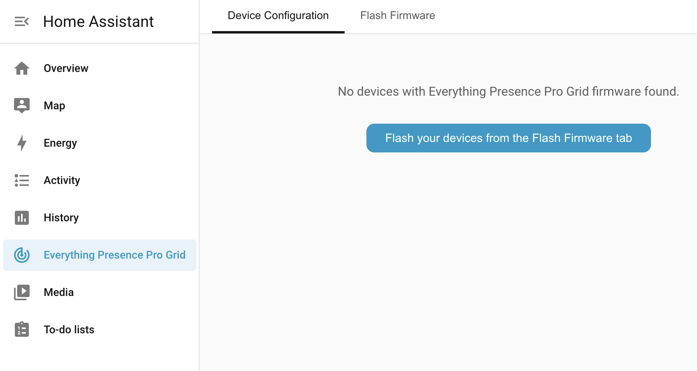

# Installation

This page walks through installing the Everything Presence Pro Grid integration into Home Assistant. It assumes you already have Home Assistant running — the integration itself is a HACS custom integration that plugs into your existing HA setup.

## Prerequisites

- Home Assistant 2025.2.0 or newer.
- [HACS](https://hacs.xyz/) installed.

## Install via HACS (recommended)

HACS is the recommended route. It installs the integration from source, tracks updates, and handles upgrades in one click. This is the path you want unless you can't run HACS for some reason.

1. Open **HACS** in the Home Assistant sidebar.
2. Click the three-dot menu in the top right and choose **Custom repositories**.
3. Paste `https://github.com/clintongormley/everything-presence-pro-grid` into the repository field, pick **Integration** as the type, and click **Add**.
4. Close the dialog. Search for **Everything Presence Pro Grid** in HACS and click **Download**.
5. Restart Home Assistant.

!!! note
    The integration isn't in HACS's default catalogue, which is why the custom-repository step is needed. Once added, future updates show up in HACS like any other integration.

!!! example "Screenshot placeholder"
    **HACS Custom repositories dialog with the Everything Presence Pro Grid repo URL filled in.** `installation/hacs-custom-repo.png`

## Install manually

If you can't use HACS:

1. Download the latest release archive from the [Releases page](https://github.com/clintongormley/everything-presence-pro-grid/releases).
2. Unpack it and copy `custom_components/eppgrid/` into your HA config's `custom_components/` folder.
3. Restart Home Assistant.

## After installing

1. Go to **Settings → Devices & services → Add integration**, search for **Everything Presence Pro Grid**, and add the entry.
2. The **Everything Presence Pro Grid** panel appears in the HA sidebar. If it doesn't show up, hard-refresh the HA web UI (Ctrl-F5 / Cmd-Shift-R).
3. The panel starts empty. See [Flashing firmware](flashing-firmware.md) to put Grid firmware on your first device.

## Troubleshooting

| Symptom | Likely cause | Fix |
| --- | --- | --- |
| HACS doesn't list the integration after adding the custom repo | HACS hasn't rescanned its catalogue yet | Restart Home Assistant, then open HACS again. The integration shows up under **Integrations**. |
| Integration installed but the panel doesn't appear in the HA sidebar | Integration entry hasn't been added yet | Go to **Settings → Devices & services → Add integration** and add **Everything Presence Pro Grid**. If the panel still doesn't appear, hard-refresh the HA web UI (**Ctrl-F5** / **Cmd-Shift-R**). |
| "Integration update required" banner appears immediately after install | Your device firmware is newer than the integration release you've just installed | Either update the integration to a newer release in HACS, or downgrade the firmware to match. |
| Manual install done but panel still not appearing | `custom_components/eppgrid/` is in the wrong place, or nested one level too deep | Verify the `eppgrid/` directory sits directly under your HA config's `custom_components/` folder (not inside a subdir), and check HA logs for import errors. |

See also: the [central Troubleshooting](troubleshooting.md) page for conceptual FAQ and how to open a GitHub issue.

## Where to next

- **[Flashing firmware →](flashing-firmware.md)** — put Grid firmware onto your device.
