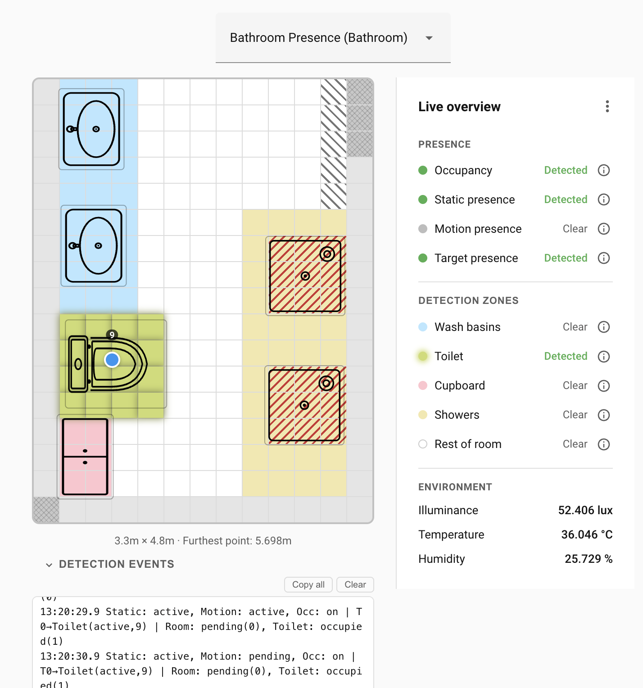
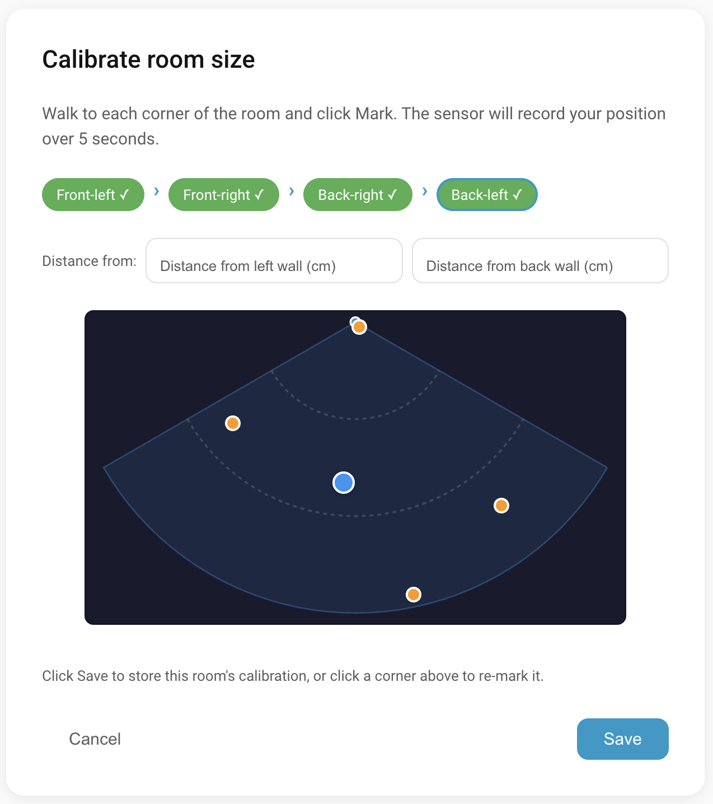
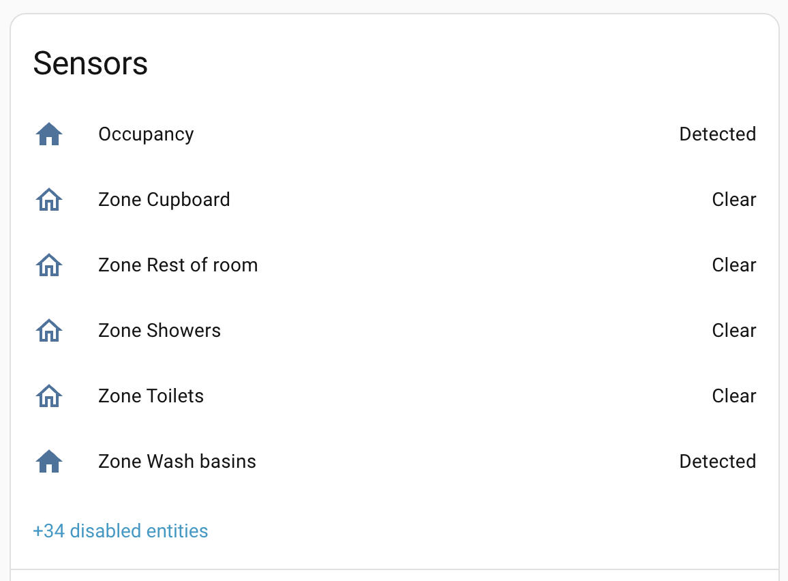

# Introduction

Everything Presence Pro Grid is a custom Home Assistant integration for the Everything Presence Pro mmWave radar sensor. It runs smoothed target tracking and zone detection processing on the device, and provides a panel for configuration, calibration, live overview, and firmware flashing.

For setup, see [Hardware](hardware.md), [Placement](placement.md), and [Installation](installation.md).

## What is the Everything Presence Pro?

The [Everything Presence Pro](https://shop.everythingsmart.io/products/everything-presence-pro) (EPP) is a presence sensor produced by [Everything Smart Technology](https://shop.everythingsmart.io/). Where a motion sensor only detects movement, a presence sensor uses low-powered mmWave radar to detect human presence even when the person is still.

The EPP combines three sensors for the best of all worlds:

- **PIR (passive infrared) motion sensor.** Low latency — useful for triggering main lights the moment someone enters.
- **Target tracking radar (LD2450).** Tracks up to three targets in the room. Lets automations react to targets entering or leaving specific zones (turning on the extractor fan when someone uses the toilet, towel rail when someone showers).
- **Static presence radar (DFRobot).** Detects ongoing presence through subtle movement like breathing, even when targets aren't moving. Lets automations safely turn lights off when the room is actually empty.

## Problems with the original firmware

The original firmware sends raw sensor data to Home Assistant. That leaves a few gaps:

- **Noise.** Target (X,Y) coordinates are passed through unsmoothed. The radar is jittery and that noise produces unreliable zone transitions.
- **Distortion.** The default radar view is a polar projection — straight walls don't appear straight, which makes mapping a room difficult.
- **Limited zones.** Four detection zones plus two exclusion zones, all rectangular and aligned with the sensor — but real-world rectangles aren't rectangles in the radar view.
- **Coarse settings.** A target is either inside a zone or not. There's no notion of where it came from (entered through the doorway vs appeared mid-room), how long it's been there, or how long since last movement — a problem when people sleep still.
- **Resolution mismatch.** The configurator draws at 5 cm precision but the LD2450 resolves at ~36 cm. The detail in the UI overstates what the sensor actually sees.
- **Chattiness.** Each device streams a high volume of coordinate updates that Home Assistant mostly discards. With 10–15 sensors, that adds up.

## What this integration does differently

- **Perspective-corrected grid.** A four-corner calibration wizard maps the sensor view onto your room. Walls are straight; zones line up with real-world geometry. Cells are 30 cm × 30 cm (1 ft × 1 ft).
- **Seven painted zones**, plus an eighth "Rest of room" fallback. Polygonal, can be discontinuous, drawn by clicking grid cells.
- **Zone types** — `Default`, `Bed`, `Seating`, `Transit` — preset sensitivity and hysteresis (stickiness) for the zone's purpose. `Custom` exposes the underlying parameters.
- **Cross-zone target tracking.** Targets are followed as they move between zones, allowing quick transitions from one zone to another.
- **Overlays** for refining detection — mark doorways (Entry/Exit) and noise sources (Interference/Suppress).
- **Furniture layout.** Drop furniture stickers on the grid so the live overview is readable. Visual only; doesn't affect detection.
- **On-chip processing.** Home Assistant gets a single `Occupancy` binary sensor plus per-zone presence sensors, instead of a stream of target coordinates.
- **Rolling-median smoothing** of target positions, so brief radar jitter doesn't trigger ghost detections.
- **Quiet updates.** Only the necessary information goes across the network.
- **Built-in flasher** for installing and updating firmware from the panel.

## What you'll typically use in automations

Most rooms only need:

- `binary_sensor.<device>_occupancy` — anyone in the room. Combines the motion sensor, the static presence sensor, and the target tracking sensor into a single presence signal.
- `binary_sensor.<device>_zone_<N>_presence` — one per named zone.
- The environmental sensors (illuminance, temperature, humidity, CO2 if enabled).

These sensors are all you need to write sophisticated presence-tracking automations. See [Automations](automations.md) for worked examples.

## Where to next

- **[Hardware →](hardware.md)** — what's inside the device.
- **[Installation →](installation.md)** — install the integration and get going.
