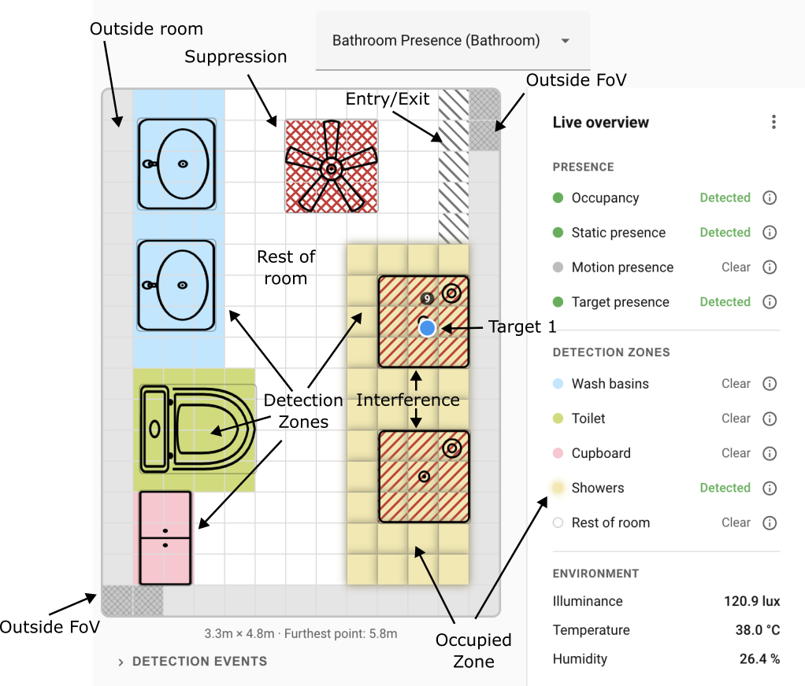

# Live overview

The live overview is the home page of the Device Configuration tab. It shows the calibrated grid with your zones, overlays, and furniture in place, and updates live as the sensor tracks targets. This page covers how to read it.

## The grid

The grid is a top-down view of your room after calibration. Each cell is the unit of detection; the zone engine decides presence and target counts in terms of cells.

- White cells indicate cells inside the room that don't belong to any zone, i.e. "Rest of room".
- Grey cells indicate cells outside the room.
- Grey cells with cross hatching indicate cells which are outside the FoV (field of view) of the target tracking sensor.
- Detection zones are drawn as coloured regions using the colour you picked in the zones editor.
- Overlays show as hatched patterns: Entry/Exit cells use a grey 45° diagonal stripe; Interference cells use a single red -45° diagonal stripe; Suppress cells use red cross-hatching (both diagonals).
- Furniture sits on top of zones and overlays as a visual layer.
- Below the grid, the panel shows the room's width × depth plus the distance to the furthest point the sensor can still track (useful for sanity-checking that important corners are inside the LD2450's 6-metre tracking range).

## Target markers

The LD2450 tracks up to 3 targets at a time. Each is drawn as a dot on the grid:

- **Per-target colours** — each tracked target slot has its own colour from a fixed palette, so you can tell separate targets apart at a glance. The colour identifies the slot, not the movement state; it stays the same as the target moves around.
- **Signal label** — a target shows its signal-strength value (1..9) as a small label above the dot.

## Side bar

On the right-hand side bar, you will see live data being fed directly from the sensor. Not all of the corresponding entities are enabled in ESPHome, but they can be enabled in the [**Entity Settings**](settings/entities.md) section.

### Presence sensors

- **Occupancy** — combined presence signal. This is the one you'll usually automate against.
- **Motion Presence** — the PIR (passive infrared) sensor as a binary sensor. 
- **Static Presence** — the SEN0609 static-presence sensor. 
- **Target Presence** - the LD2450 target tracking presence.

By default, only the Occupancy entity is enabled under ESPHome.

### Detection zones occupancy glow

When a zone is occupied, its colour brightens and gets a subtle glow, and the zone is marked as **Detected** in the side bar. This is the most direct visual confirmation that automations are about to fire for that zone — if the glow is on, the corresponding `binary_sensor.<device>_zone_N_presence` entity in Home Assistant is `on`.

Entities for all configured zones are enabled by default under ESPHome.

### Environmental sensors

In the  **Environment** section, you can see the four environmental sensors:

- **Illuminance** (lux) 
- **Temperature** (°C)
- **Humidity** (%)
- **CO2** (ppm) — the CO2 sensor is an optional extra and may not be installed on your device. You will only see the CO2 reading on the live overview if the chip is present and producing readings. See [Integrate the Carbon Dioxide (CO2) module](https://docs.everythingsmart.io/s/products/doc/integrate-the-carbon-dioxide-co2-module-biegKGfCWu) for the hardware install.

The **Illuminance**, **Temperature**, and **Humidity** entities are enabled by default. The **CO2** entity (and the related **Calibrate CO2 button**) is disabled by default.

## Connection and firmware-status banners

When something's wrong, the live grid is replaced by a banner rather than being shown with stale data.

- **Offline device** — a connection banner tells you the device has dropped off the network. The grid is hidden until the device reconnects. If this sticks, check that the device is still powered and on the network.
- **Firmware / integration version mismatch** — a protocol banner appears when the integration is older than the device firmware, or vice versa. The banner explains which side to update. Usually: open HACS to update the integration, or the Flash Firmware tab to OTA-update the device.

## Troubleshooting

| Symptom | Likely cause | Fix |
| --- | --- | --- |
| Grid is blank or shows no sensor data | Device is offline | Check **Settings → Devices & Services → ESPHome** — the device should be listed and marked online. |
| Targets jump around or drift outside walls | Calibration is off | Re-run the calibration wizard. See [Calibration](calibration.md). |
| Target stuck on a fixed cell with nobody there | Interference source at that cell (fan, curtain, reflective surface) | Add an Interference overlay at that cell. If it's still problematic, escalate to Suppress. See [Overlays](overlays.md). |

See also: the [central Troubleshooting](troubleshooting.md) page for conceptual FAQ and how to open a GitHub issue.

## Where to next

- **[Detection zones →](detection-zones.md)** — paint named regions on the grid so each one fires its own presence entity.
