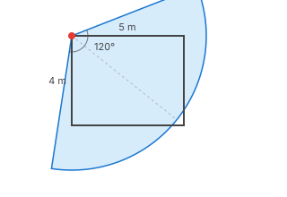
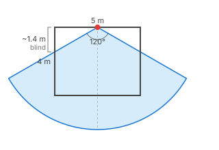
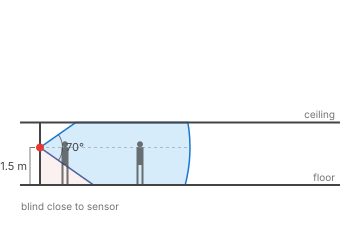
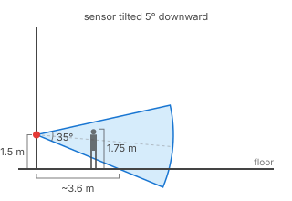
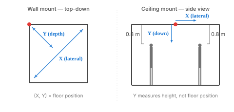
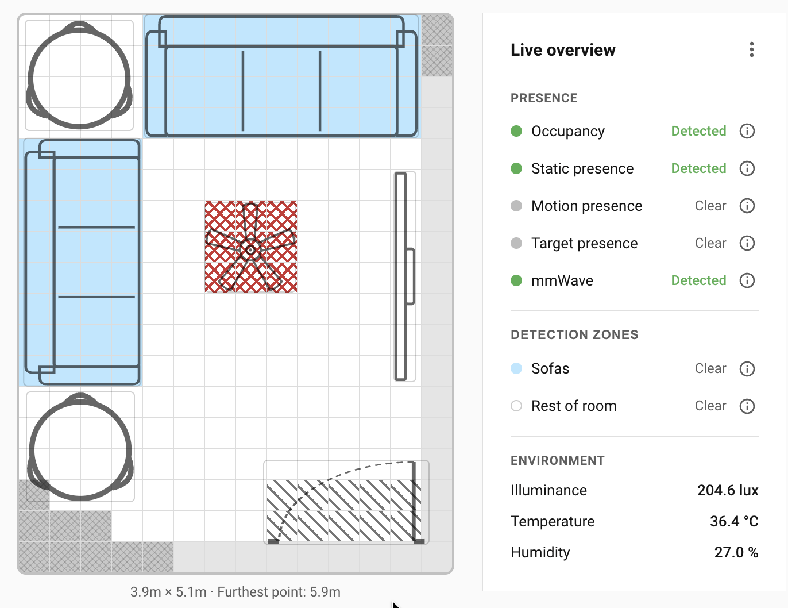

# Placement

Good placement gives you a room that calibrates cleanly and leaves the zones you care about inside the LD2450's tracking circle. The two radars' fields of view and effective ranges decide what's possible.

## Corner mount (recommended)

Mount the device in a room corner, pointing towards the opposite corner (or towards the areas of most interest).

**Why a corner works:** the LD2450's 120° horizontal FOV is wider than a room corner's 90° internal angle, so the FOV cone fits neatly into a corner. From a corner, one sensor can cover a rectangular room's entire interior without dead spots.

{ width="80%" }

Practical guidance:

1. Pick the corner opposite the door, or the corner that gives the clearest view of the zones you care about most.
2. Mount pointing towards the opposite corner, or in the direction which will give you the best coverage of areas of interest.
3. Avoid corners blocked by furniture or walls on either side of the device. The FOV needs to project into open space.

**Why a mid-wall mount is harder:** with 120° FOV, the device sees ±60° of the wall it's mounted on. A mid-wall mount typically leaves triangular dead zones at each end of the mounting wall, unless the room is narrower than the FOV can cover.

{ width="80%" }

## Mounting height (1.3–2.0 m)

Mount between 1.3 m and 2.0 m above the floor, and angle the device slightly down so the aim reaches about 1 m height in the opposite corner of the room.

The useful detection height is around 1 m, waist level for an adult. Aimed horizontally, the upper half of the cone clears adult head height and catches nothing useful. Tilting the device down a few degrees moves that coverage into the 0.5–1.5 m band where bodies are.

{ width="80%" }

{ width="80%" }

For a tall room, bias toward the lower end of the range. For a long narrow room, bias toward the upper end so the cone reaches further down the room before the aim line drops below useful height.

Close to the sensor the cone is narrow in height — within a metre or so of the mount, someone can be below the lower edge before detection catches. Pick a corner that puts the zones you care about a few metres out from the device, not right underneath.

## Ceiling mount (not supported)

Although the Everything Presence Pro ships with a ceiling mount, mounting the device on the ceiling is not recommended and is not supported by this integration. From directly overhead, the LD2450's 35° vertical cone only reaches the floor in a small circle immediately beneath. For a 2.5 m ceiling, the usable coverage circle is roughly 1.6 m across. Everything outside that small circle falls below the cone's edge and out of detection.

The LD2450's vertical FOV is designed for wall mounting. From the ceiling, most of the room ends up in the cone's blind spot regardless of how you orient the device, and calibration can't correct for it.

!!! warning
    Ceiling mounting is not currently supported. If you've mounted a device on the ceiling in a previous installation, move it to a wall corner before running calibration.

    If you have a good use case for ceiling mounting, open an issue with your rationale and we can discuss it.

{ width="80%" }

## Tracking range vs static-presence range

The two radars have different effective ranges, which affects where you can place zones.

- **LD2450 tracking circle — 6 m.** Inside this circle the sensor reports 2D target coordinates, which the zone engine uses for per-zone presence and target-count entities. Outside this circle the LD2450 can still see radar returns but can't localise them into coordinates.
- **SEN0609 presence circle — 16 m.** Inside this much larger circle the SEN0609 reports a single "someone is here" signal, with no coordinates.

Practical consequence:

- **Zones of interest must fit inside the 6 m tracking circle.** A zone at 7 m from the sensor won't get per-target counts or movement-based zone-entry events. It will still contribute to room-level occupancy through the SEN0609 and the combined Occupancy sensor, just not through zone-specific entities.
- For larger rooms, this is usually the main constraint on where to mount the sensor. Pick a corner that puts your important zones inside the 6 m circle.

In the image below the sensor is monitoring the two entrances with the LD2450 tracking sensor, but its range doesn't reach the sofa. The static sensor still tells us there is somebody in the room, which may be enough for your needs.

{ width="80%" }

## Obstructions and interference

The sensor needs a clear line of sight to the room corners. Anything blocking a corner will either force you to enter offsets manually during calibration or throw the calibration off entirely. Move large furniture out of the corners before calibrating if you can; if you can't, use the wizard's offset fields to compensate.

Known noise sources (ceiling fans, billowing curtains, large reflective surfaces) inside the FOV will produce radar returns. The radar sees the motion even though there's no person involved. Adjusting the mount won't help — handle these after calibration with Interference or Suppress overlays. See [Overlays](overlays.md#when-to-use-each) for which tool fits which situation.

## Worked example: a 4 × 5 m living room

- **Room:** 4 m × 5 m with one door, a ceiling fan in the centre, and a sofa against the long wall opposite the door.
- **Mount location:** the corner diagonally opposite the door, above the side table.
- **Orientation:** angled towards the opposite corner, so the 120° FOV covers the whole floor.
- **Mount height:** 1.3 m, tilted slightly to include people seated on the sofas.
- **Zone of interest:**
    - "Sofas" — ~1 m from the sensor, comfortably inside the 6 m tracking circle.
- **Follow-ups after calibration:**
    - Entry/Exit overlay painted across the doorway cells.
    - Interference overlay on the ceiling-fan cell.

That setup covers the whole room with tracking, keeps the sensor out of sight-lines and foot traffic, and lets the SEN0609 hold occupancy when people settle still on the sofas.

## Where to next

- **[Calibration →](calibration.md)** — run the four-corner wizard so the grid matches the real geometry of your room.
