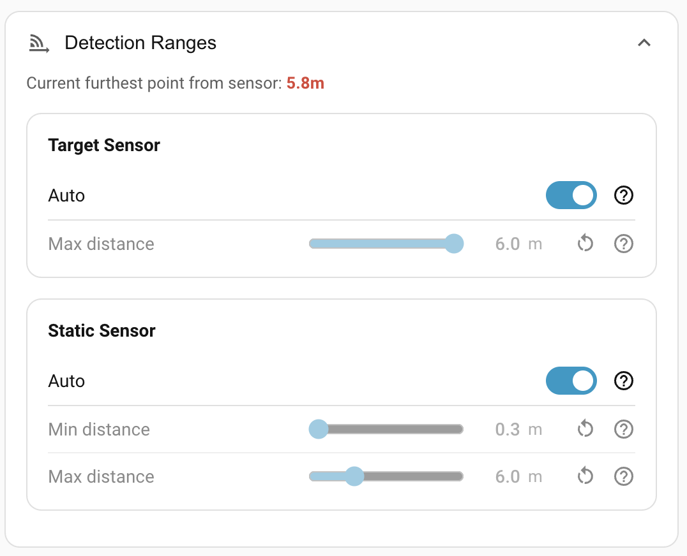

# Detection ranges

How far the two mmWave radars are allowed to see. Lives under **Settings → Detection Ranges** in the panel.

## Why change a sensor's range?

The SEN0609 reaches up to 16 m — more than most rooms need. The LD2450 caps at 6 m, which often *isn't* enough to cover an entire room. The right range depends on the room and on what you want each sensor to be responsible for.

The room calibration tells the panel where your walls are; the **Auto** toggle on each sensor uses that to compute a sensible default — the distance from the sensor to the furthest cell of your room grid. Two motivating cases:

**Two sensors in one long room.** A combined kitchen-and-dining-room is too big for a single device, so you put one at each end. With both running at full range, the static-presence sensor at the kitchen end picks up someone sitting at the dining-room end and vice versa. Letting **Auto** clip each device to roughly its half of the room — driven by each device's own room calibration — keeps each one focused on its own area.

**One sensor in a large room, with the static sensor doing rest-of-room coverage.** The LD2450 handles the important zones — entrances, high-traffic areas — but you want the SEN0609 to keep the *rest* of the room marked occupied when someone settles down. Turn **Auto** off on the static sensor and set **Max distance** manually to push it further than the auto default.

If you've recalibrated and your room got bigger, an **Auto**-set range adjusts on its own. A manually set range doesn't.

## Target sensor (LD2450)

The LD2450 is the target tracker — the radar that drives target tracking and zone detection. See [Hardware → LD2450](../hardware.md#ld2450-movement-tracker).

| Control | Default | Notes |
| --- | --- | --- |
| **Auto** | On | Use the calibrated room dimensions to set max distance. |
| **Max distance** | 6 m (auto) | Hardware limit. Range 0.5–6 m when set manually. Greys out while **Auto** is on. |

The LD2450 has no minimum range setting (the chip itself reports targets from a few centimetres outward) and no separate sensitivity dial — its reliability scoring is the per-target signal that the engine computes from frame visibility. See [How detection works → Smoothing and signal strength](../how-detection-works.md#smoothing-and-signal-strength).

## Static sensor (SEN0609)

The SEN0609 mmWave radar reports binary presence — "someone here" or "not here". See [Hardware → SEN0609](../hardware.md#sen0609-static-presence-radar).

| Control | Default | Notes |
| --- | --- | --- |
| **Auto** | On | Use the calibrated room dimensions to set max distance. Min stays at 0.3 m. |
| **Min distance** | 0.3 m | Range 0.3–16 m. Greys out while **Auto** is on. |
| **Max distance** | 16 m (auto) | Hardware limit. Range 2.4–16 m when set manually. Greys out while **Auto** is on. |

A non-zero **Min distance** is occasionally useful when something close to the device — a houseplant, a draught — is fooling the static sensor. Push the minimum out past it.

The SEN0609's sensitivity and timing controls (presence delay, presence timeout, trigger / renew thresholds) live separately under **[Sensor calibration](sensor-calibration.md)**.

## Resetting

Each row has a **↺ reset** button that returns just that control to its default.

## Where to next

- **[Sensor calibration](sensor-calibration.md)** — sensitivity and timing for the motion and static sensors.
