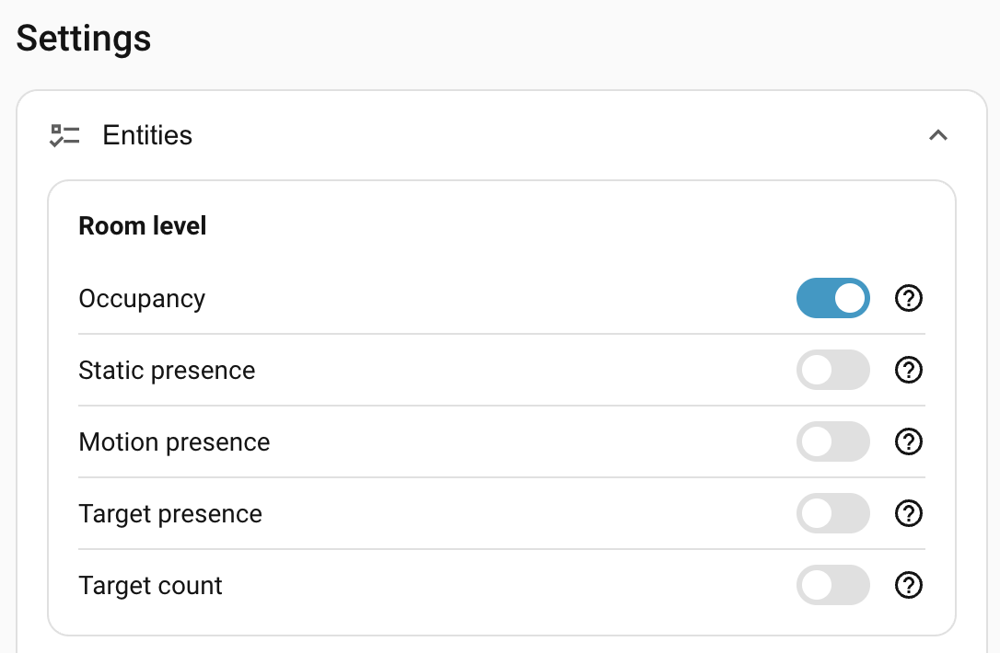
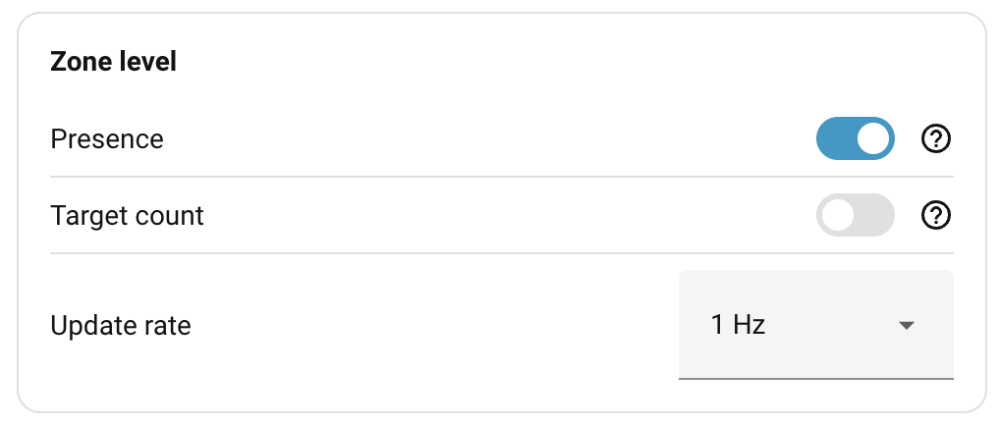
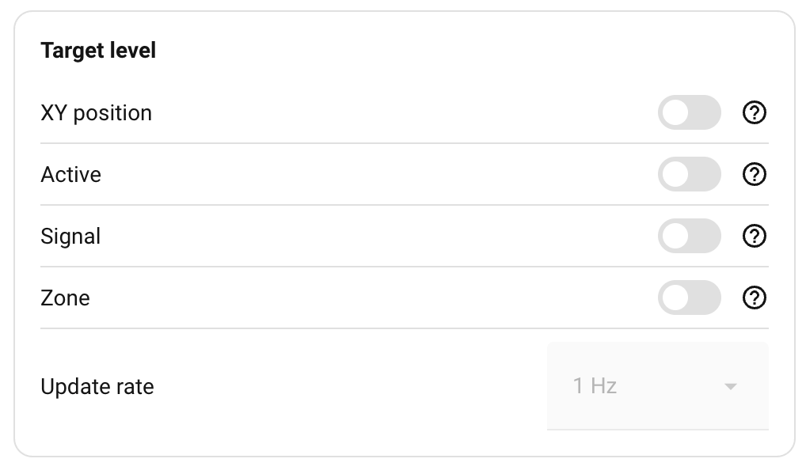
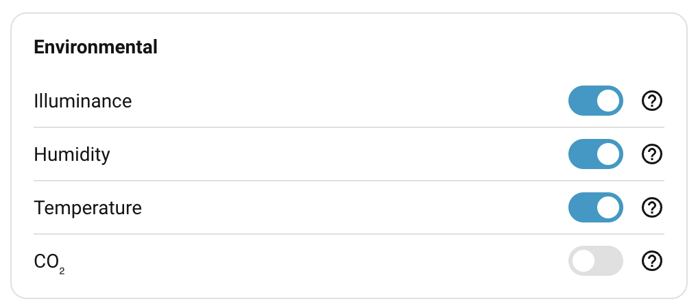

# Entities

The device can potentially publish a lot of state, most of which isn't needed. The defaults expose what most automations actually need — room occupancy, per-zone presence (once calibrated), and the environmental readings — and leave the rest disabled. 

Toggle a row under **Settings → Entities** and click **Save** to enable or disable the matching Home Assistant entity.

## Room level

Room-wide presence and target counts. These are the entities you'll most often automate against.

| Entity | Default | What it reports |
| --- | --- | --- |
| **Occupancy** | On | Combined room presence — flips on when *any* of the zone, motion, or static signals say "someone here". This is the entity to use for "is anyone in the room". See [How detection works](../how-detection-works.md#the-occupancy-entity). |
| **Static presence** | Off | Raw output of the SEN0609 mmWave static-presence radar (with its own pending state applied). Useful for debugging or for automations that should only react to genuine stillness. |
| **Motion presence** | Off | Raw output of the PIR motion sensor (with its own pending state applied). Useful for low-latency triggers — entry detection, security automations. |
| **Target presence** | Off | True whenever the LD2450 is actively tracking at least one target. Independent of any zone. |
| **Target count** | Off | Number of targets the LD2450 is currently tracking (0–3), independent of any zone. |

## Zone level

Per-zone state. There are eight zone slots: zone 0 (the **Rest of room**, everything outside any named zone) plus seven user-paintable zones. Each enabled zone produces its own pair of entities.

| Entity | Default | What it reports |
| --- | --- | --- |
| **Presence** | On (when calibrated) | Per-zone occupancy — driven by the [zone state machine](../how-detection-works.md#the-zone-state-machine). |
| **Target count** | Off | Number of LD2450 targets currently inside the zone. |
| **Update rate** | 1 Hz | How often the zone entities above publish. See [Update rate](#update-rate). |

These entities only appear once the room is calibrated — before that there's no concept of zones.

## Target level

Per-target output from the zone engine, exposed as up to three target slots. These are the positions smoothed by the engine's rolling one-second window (see [How detection works → Smoothing and signal strength](../how-detection-works.md#smoothing-and-signal-strength)) and the signal value is the engine's 0–9 reliability score. Enabling these gives you direct visibility into what the engine sees per target, but the data updates frequently and isn't useful for most automations. Treat it as debug- or research-grade.

| Entity | Default | What it reports |
| --- | --- | --- |
| **XY position** | Off | Each target's `x, y` position mapped to the room grid. |
| **Active** | Off | Per-slot tracking state — whether slot 1, 2, or 3 currently holds a target. |
| **Signal** | Off | Per-slot 0–9 signal strength. See [How detection works → Smoothing and signal strength](../how-detection-works.md#smoothing-and-signal-strength). |
| **Zone** | Off | Which zone each target is currently inside. |
| **Update rate** | 1 Hz | How often the target entities above — plus the room-level **Target count** — publish. See [Update rate](#update-rate). |

Target-level entities also require a calibrated room.

## Environmental

Climate readings from the on-board sensors. Independent of presence detection — they just report room state. Each toggle controls whether the matching HA entity is exposed.

| Entity | Default | What it reports |
| --- | --- | --- |
| **Illuminance** | On | BH1750 lux meter. |
| **Humidity** | On | SHTC3 relative humidity. |
| **Temperature** | On | SHTC3 temperature. |
| **CO₂** | Off | SCD4x. **Optional add-on** — the entity stays unavailable if the module isn't fitted. See [Hardware → Environmental sensors](../hardware.md#environmental-sensors). |

!!! note
    Temperature and humidity readings are biased by the device's own waste heat and by where it's mounted. Use the [environmental offsets](sensor-calibration.md#environmental-offsets) under Sensor calibration to nudge the average closer to a reference, or treat the readings as trends rather than absolutes.

## Update rate

Both the Zone-level and Target-level groups end with an **Update rate** dropdown — how often the device publishes the entities in that group to Home Assistant. The zone engine itself runs at 10 Hz on the device regardless; the rate just controls how much of that output is forwarded.

| Rate | Interval |
| --- | --- |
| **5 Hz** | 200 ms — sub-second responsiveness, heavy on the recorder. |
| **2 Hz** | 500 ms |
| **1 Hz** | 1000 ms — **default**, the right balance for most rooms. |
| **0.5 Hz** | 2000 ms — quietest, fine for occasional inspection. |

The **Zone update rate** dropdown drives **zone presence** and **zone target count**. The **Target update rate** dropdown drives **XY position**, **active**, **signal**, **target zone**, and the room-level **target count**. Each dropdown is greyed out unless at least one entity in its group is enabled — there's nothing to publish at any rate.

Room-level occupancy / motion presence / static presence / target presence and the environmental sensors are not governed by these dropdowns — they publish on their own fixed cadence.

## Where to next

- **[Detection ranges](detection-ranges.md)** — how far each mmWave radar is allowed to see.
- **[Sensor calibration](sensor-calibration.md)** — sensitivity and timing for the motion and static sensors.
