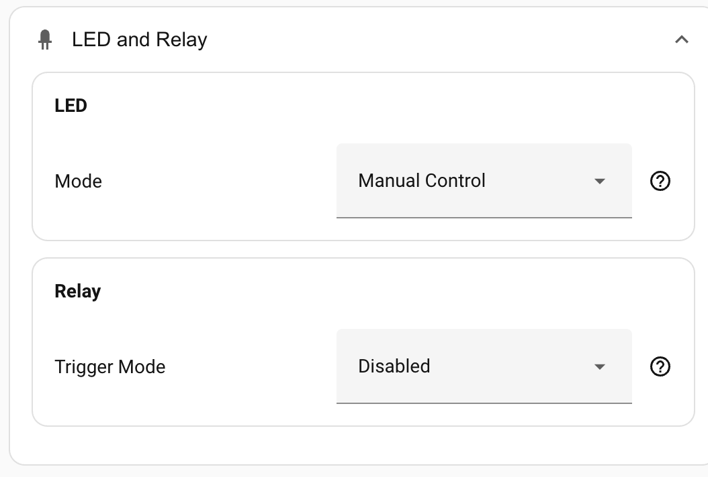
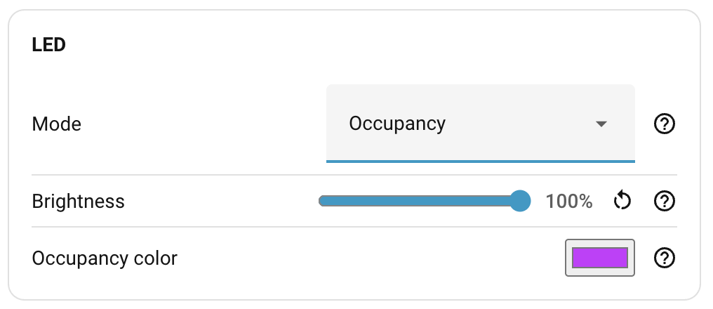

# LED and relay

Configure the front LED and the solid-state relay output. Both live under **Settings → LED and Relay** in the panel.

## LED

The device has a single addressable RGB LED on the front. The Mode below selects what the device drives the LED to *automatically* — based on occupancy, CO₂ level, or nothing at all. Independently of that, the LED is always exposed in Home Assistant as a light entity that you can drive from your own automations regardless of the chosen mode.

### Mode

| Mode | What the LED shows | Notes |
| --- | --- | --- |
| **Manual control** | Whatever you set via the light entity. | **Default.** No automatic colour or brightness — the LED reflects only what your automations or the entity's UI tell it. |
| **Occupancy** | Solid in the **occupancy colour** when occupied; off when clear. | Driven by the same combined Occupancy signal the integration exposes — see [How detection works → The Occupancy entity](../how-detection-works.md#the-occupancy-entity). |
| **Environmental** | Colour reflects CO₂ level (green → yellow → red). | Needs the optional CO₂ chip fitted to read against. |
| **Environmental + Occupancy** | Combines both — environmental colour scale while the room is occupied; off when clear. | Same CO₂ requirement. |

The firmware itself supports CO₂ on every variant — there's no separate "CO₂-capable" build to flash — but the Environmental modes have nothing to read without the optional CO₂ chip fitted to the device.

In any of the automatic modes you can still call the light entity from an automation; the device just rewrites the LED on the next occupancy or CO₂ event.

### Brightness

When any automatic mode is selected (anything other than Manual control), a **Brightness** slider appears. It's a multiplier from 10 % to 100 % applied to whatever colour the chosen mode wants to show.

In Manual control the slider is hidden — brightness comes from the light entity itself.

### Occupancy colour

When the mode is **Occupancy** or **Environmental + Occupancy**, a colour picker appears for the occupancy colour. Pick whatever you like — the mode applies that colour while the room is occupied.

Environmental mode's colour scale (green/yellow/red for CO₂) is fixed and not user-configurable.

## Relay

The device has a solid-state relay you can wire into a circuit — typical use is feeding presence into an alarm panel that wants a dry contact, or driving low-voltage equipment directly. See the [hardware overview](https://docs.everythingsmart.io/s/products/doc/hardware-overview-gqc0XAh0e5) for wiring and load ratings.

The relay can either follow a presence signal automatically, or stay under manual control via its switch entity in Home Assistant.

### Trigger mode

| Mode | The relay activates on… |
| --- | --- |
| **Disabled** | Nothing — the relay is fully under manual control via the switch entity. **Default.** |
| **Motion only** | The PIR motion sensor going active. |
| **Presence only** | The SEN0609 static-presence sensor going active. |
| **Occupancy** | The combined Occupancy signal — any of motion, static, or zone activity. |

When trigger mode is anything other than **Disabled**, manual control via the switch entity is overridden — the relay follows the chosen signal automatically.

### Contact mode

Visible only when a trigger mode other than **Disabled** is selected.

| Mode | Behaviour |
| --- | --- |
| **Normally Open (NO)** | Relay closes when the trigger fires. **Default.** Pick this for the typical "active = closed" convention. |
| **Normally Closed (NC)** | Relay opens when the trigger fires. Useful for security circuits that expect a closed loop in the idle state and an open one on alarm. |

## Where to next

- **[Logging](logging.md)** — per-component log levels.
