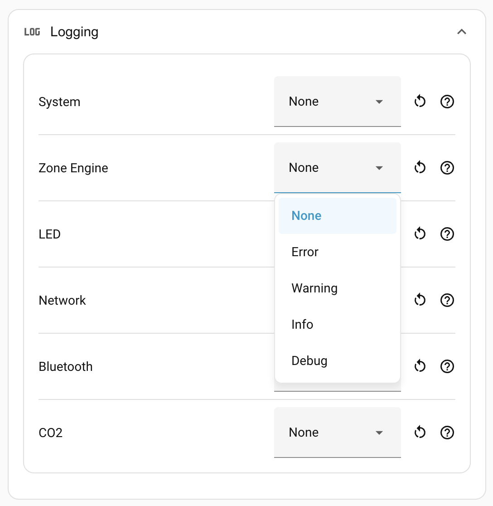

# Logging

The per-component log levels for the device firmware are useful when you're
debugging an unfamiliar problem: raise the level on the relevant component,
reproduce the issue, read the logs. Once you're done, set everything back to
**None** so you're not paying for verbose logging that you don't need.

The controls live under **Settings → Logging** in the panel.

## Components

Each row is a logical group of log tags inside the firmware. Set the level high
to see more from that group. Leave it at **None** to use the firmware's
compiled-in default (effectively quiet: errors and the firmware's own boot
output).

Every component is always listed, whether or not the matching hardware is
fitted. A row with no hardware behind it — CO2 on a device without the module —
simply stays silent.

| Component       | What it covers                                                                                                                                                                                                                                                                                       |
| --------------- | ---------------------------------------------------------------------------------------------------------------------------------------------------------------------------------------------------------------------------------------------------------------------------------------------------- |
| **System**      | Everything not owned by another row: OTA, API client, mDNS, I²C, the radar feed (LD2450) and other sensor drivers (SHTC3, BH1750, SEN0609), plus control entities (lights, switches, numbers, selects, buttons). Zone and target entity updates do **not** appear here — they belong to Zone Engine. |
| **Zone Engine** | The zone-detection engine itself: target tracking, cell mapping, the zone state machine, configuration changes — and the zone/target/motion entity states (zone target counts, target positions, Motion Presence). Raise this when a zone is misbehaving.                                            |
| **LED**         | LED control script: mode transitions and the decision tree that picks the displayed colour.                                                                                                                                                                                                          |
| **Network**     | Wi-Fi or Ethernet connection events, DHCP, link state.                                                                                                                                                                                                                                               |
| **Bluetooth**   | BLE scanner and proxy logs.                                                                                                                                                                                                                                                                          |
| **CO2**         | SCD4x sensor logs.                                                                                                                                                                                                                                                                                   |

## Levels

| Level       | What you get                                                                              |
| ----------- | ----------------------------------------------------------------------------------------- |
| **None**    | **Default.** Use the firmware's compiled-in level.                                        |
| **Error**   | Only error-class messages.                                                                |
| **Warning** | Errors and warnings.                                                                      |
| **Info**    | Notable events: state transitions, configuration applied.                                 |
| **Debug**   | Frame-by-frame detail. Quite chatty; expect a lot of output, especially from Zone Engine. |

The levels are cumulative: Debug includes everything below it.

## Reading the logs

Setting the firmware level here is only half the picture: messages don't reach
Home Assistant's logs until you also enable debug logging on the integration.
See
[Troubleshooting → Capture debug logs](../troubleshooting.md#2-capture-debug-logs)
for the full walkthrough.

## Resetting

Each row has a **↺ reset** button that returns just that component to **None**.

## Where to next

- **[Device groups →](../device-groups.md)** — combine several sensors into one
    virtual presence device for whole-room coverage.
