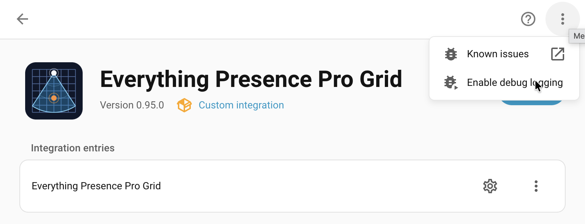
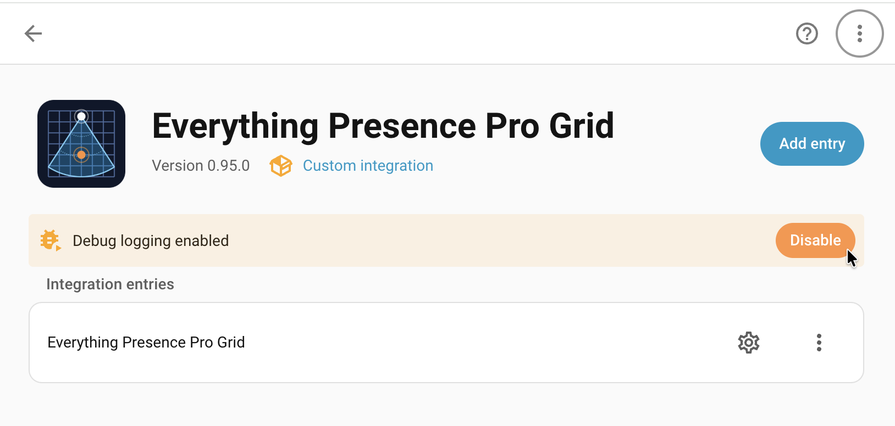

# Troubleshooting

Each feature page in this user guide ends with a Troubleshooting table covering symptoms specific to that area. If you've worked through the relevant one and the problem isn't there, open a GitHub issue.

## Device keeps going unavailable

Each device has six diagnostic entities under **Settings → Devices & services → ESPHome → \[your device\] → Diagnostic** (filter by Diagnostic in the entity card menu). They make it easy to tell whether an "unavailable" episode in HA history was a real reboot (memory exhaustion, brownout, watchdog) or just a network blip:

- **Heap Free** — current free RAM in bytes.
- **Heap Largest Block** — biggest contiguous chunk available; lower than `Heap Free` indicates fragmentation.
- **Heap Min Free** — lowest the heap has *ever* been since boot. Only resets on reboot.
- **Loop Time** — max main-loop time in the last minute. Spikes correlate with memory pressure or BLE work.
- **Uptime** — seconds since boot. Drops to ~0 on every reboot.
- **Reset Reason** — *why* the last reboot happened: `POWERON` (cold start), `EXT` (manual restart), `SW_CPU` / `TASK_WDT` / `INT_WDT` / `LOAD_PROHIBITED` (firmware crash, often memory-related), `BROWNOUT` (power dip).

**How to diagnose**: open HA history for **Heap Min Free** and **Uptime**. If `Uptime` dropped to 0 around the unavailable window, the device rebooted — check `Reset Reason` for the cause. If `Uptime` kept climbing through the unavailable window, the device stayed up and you have a network problem (WiFi, router, HA connectivity), not a firmware problem.

A `Heap Min Free` reading below ~5 KB means the device has come close to running out of memory at some point this uptime cycle. If reboots correlate, you likely have an OOM problem — see the next section.

## Free up memory by disabling BLE

If `Heap Min Free` keeps dipping into single-digit KB and reboots correlate, you can disable BLE scanning to give yourself more headroom. Measured costs of BLE-on with **no proxied devices connected**:

| Metric | BLE off | BLE on | Cost of BLE-on |
|---|---|---|---|
| Heap Free (steady-state) | ~76 KB | ~71 KB | -4 KB |
| Heap Largest Block | ~53 KB | ~43 KB | -10 KB |
| Heap Min Free (worst-case dip) | ~54 KB | ~35 KB | -20 KB |

**Add ~5-10 KB resident heap per BLE device proxied through the EPP** (each open GATT connection holds its own client state, characteristic cache, and notification handlers). On the wifi-ble-co2 variant the proxy is configured for up to 3 simultaneous connections — proxying 3 active devices can therefore eat another 15-30 KB on top of the table above, plus more transient heap during their notification traffic. If you have a busy proxy and see `Heap Min Free` near zero, the trade-off shifts: you may need to either cut proxied devices or disable the scan entirely.

The always-resident cost of just-scanning-no-proxied-devices is small (~4 KB), but BLE causes ~20 KB transient spikes during scan-result processing — that's where the real headroom goes when something else (network, sensor activity) needs heap at the same moment.

Toggle the **BLE Scan** switch off under **Settings → Devices & services → ESPHome → \[your device\] → Configuration**. The device reboots once to drop any active proxy GATT connections, then comes back up with scanning disabled — and the OFF state persists across future reboots. Re-enable any time by toggling the switch back on.

The BLE controller stack itself stays loaded either way (~10-15 KB), so this isn't a full BLE-off — it stops the active scan and (after the reboot) drops any in-flight proxy connections. Most users don't need this knob; it's mostly a safety valve if you have heavy proxied-BLE load or are seeing OOM-driven reboots.

## Reporting an issue

If you've worked through the relevant feature-page Troubleshooting table and the sections above and the problem isn't covered, open a GitHub issue. To get a useful diagnosis fast, gather the diagnostics and debug logs *before* filing.

### 1. Collect diagnostics

1. In Home Assistant, go to **Settings → Devices & services**.
2. Find **Everything Presence Pro Grid** in the integration list.
3. Click the three-dot menu on the integration card → **Download diagnostics**.
4. Save the JSON file — you'll attach it to the issue below.

### 2. Capture debug logs

If the bug is something the integration logs about (errors in HA system logs, the panel showing a connection error, an automation behaving wrong), capture debug logs *before* reproducing the issue. Firmware logs stream out via the integration into Home Assistant's standard log system, but to actually see them you need both the firmware *and* the integration to be logging.

**Raise the firmware log level for the relevant components.** Under [Settings → Logging](settings/logging.md) in the panel, set the components you care about to **Debug**. For zone-related issues that's typically **Zone Engine**; for connectivity issues, **Network** or **System**.

**Enable debug logging on the integration in Home Assistant.** Go to **Settings → Devices & services → Everything Presence Pro Grid → ⋮ → Enable debug logging**.



Alternatively, call the `logger.set_level` action from **Settings → Developer tools → Actions**:

```
action: logger.set_level
data:
    custom_components.eppgrid: debug
```

**Reproduce the bug.** You can watch logs live at **Settings → System → Logs** in Home Assistant if you want to see messages as they appear. Firmware messages appear inline with the integration's own output.

**Download the captured logs.** If you used the **Enable debug logging** option on the integration page, then click **Disable debug logging** on the same page. Home Assistant writes the captured logs to a file and downloads it; attach it to the issue alongside the diagnostics JSON.



### 3. File the issue

Open the issue at [github.com/clintongormley/everything-presence-pro-grid/issues](https://github.com/clintongormley/everything-presence-pro-grid/issues).

Include the following in the issue description:

- **Home Assistant version** (e.g. 2026.4.2).
- **Everything Presence Pro Grid integration version** (from HACS, or the `manifest.json`).
- **Device firmware version** (from the device's **Firmware Version** sensor).
- **Steps to reproduce** — numbered, starting from a known state.
- **Expected vs actual behaviour.**
- **Diagnostics JSON** — attach the file you saved above.
- **Debug log file** — if you turned on debug logging, attach the downloaded log too.

